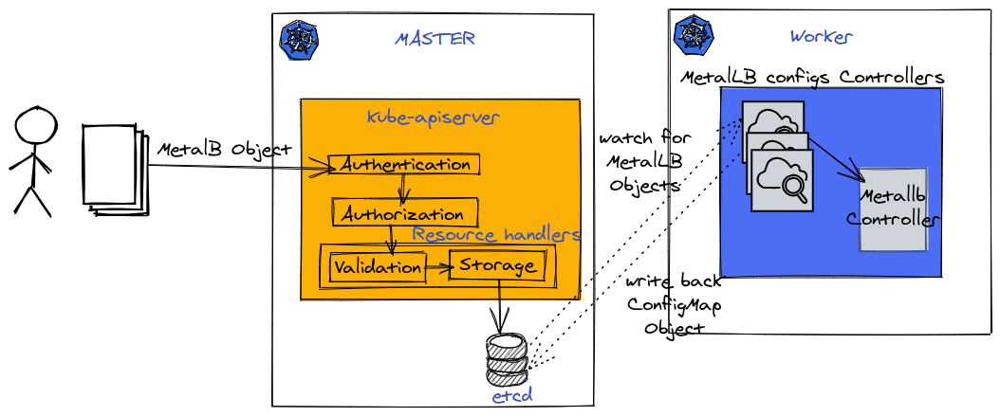

# MetalLB Custom Resource Controller

<!-- toc -->

- [Summary](#summary)
- [Motivation](#motivation)
  - [Goals](#goals)
- [Proposal](#proposal)
  - [Risks and Mitigations](#risks-and-mitigations)
- [Design Details](#design-details)
  - [Design Overview](#design-overview)
    - [Option1](#option1)
    - [Option2](#option2)  
  - [Configuration Flow](#configuration-flow)
  - [CRD Extendability](#crd-extendability)
- [Testing](#testing)
- [Debugging and Troubleshooting](#debugging-and-troubleshooting)

<!-- /toc -->

## Summary

The purpose of this enhancement is to propose an alternative configuration
interface for MetalLB based on Kubernetes Custom Resource Definitions (CRDs)
while also retaining support for the existing ConfigMap interface.

## Motivation

Today MetalLB allows only configuration using ConfigMap objects,
which is simple from configuration perspective and doesn't
require cluster-admin rights, However it doesn't have validation on the API
server level, no support for API versioning and no fine-grained permission
model via RBAC.
Custom resource definition "CRD" are managed like any other resource,
through the Kubernetes API, and eventually stored in the backend store Etcd.

### Goals

- Configuring MetalLB using kubernetes custom resource "CRD".
- Retain support of the existing ConfigMap interface for backwards
  compatibility.

## Proposal

Using [Kubebuilder](https://github.com/kubernetes-sigs/kubebuilder)
framework to build new CRDs "MetalLB" objects and a controllers which will construct
Metallb's Config objects, the Metallb Controller will watch those objects and use
them to configure Metallb.

### Risks and Mitigations

Users need to either use CRD or ConfigMap to configure MetalLB
but not both, if adminstrator mistakenly uses both, the CRD configuration will
overwrite the user defined ConfigMap.

## Design Details

### Design Overview

[Metallb CRD Design diagram](https://excalidraw.com/#json=5697710665498624,2uxfWYNvvkI6IqP-VEaQng)



There are multiple proposals been discussed during the review of this PR

#### Option1

This proposal will implement the following CRD objects :-

- Node selectors CRD which is a general objects to specify the node(s) of interest

```
node-selector:
    - match-labels:
    - match-expressions:
```    

- Protocol can now be layer2 or bgp but with FRR capability we can add ospf/is-is and other protocols

```
protocol:
```

- Address pool object (existing object w/o protocol and bgp advertisments)

```
address-pool:
    - name:
      addresses:
      auto-assign:
      avoid-buggy-ips:
```

- BGP peer object (today object w/o node selector)

```
peer:
    - peer-address:  // we can make it also subnet if we decide to support dynamic neighbors ?
     peer-asn:
     my-asn:
```

- BGP community object

```
bgp-community:
   no-advertise: 
```


- BGP advertisement object *used to be part of address pools)

```
bgp-advertisement:
      - aggregation-length: 
        localpref: 
        communities:
        - no-advertise
```

#### Option2

- MetalLBConfig CRD used to capture global configuration

```
lb-config:
    - protocol: <layer2|bgp|...>
```

- Address pool object with protocol specific configuration

```
address-pool:
    - name:
      addresses:
      auto-assign:
    - bgp-options:
      bgp-advertisment:
        - aggregation-length: 
        localpref: 
        communities:
        - no-advertise
      bgp-communities:
        no-advertise: 
    - layer2-options:
        node-selectors:
        - match-labels:
        rack:
        match-expressions:
        - key:
        operator:
        values:
      - match-expressions:
        - key:
        operator:
        values:
```

- BGP Peer object

```
peer:
  - peer-address:
  peer-asn:
  my-asn:
  node-selectors:
  - match-labels:
      rack:
    match-expressions:
    - key:
      operator:
      values:
  - match-expressions:
    - key:
      operator:
      values:
```


### Configuration Flow

1. User will supply the yaml configuration
1. Configuration will get authenticated and authorized based on RBAC rules.
1. Supplied configuration will get verified using openAPIV3Schema based on
   the definition of CRDs.
1. New objects will be stored in etcd.
1. Based on the supplied configuration, All the controllers monitor API server
   looking for creation of
   AddressPools/Peers/BgpCommunities resource.
1. The CRD's controllers will construct Configuration structure , Metallb will
   consume those objects and Errors will be flagged for unsupported configuration
   from the existing Metallb Controller.

### CRD Extendability

CRD resources can be extended to support new configuration options, the
following is a list of Metallb's configuration issues with very brief
discription of how CRD can be extended to support them.

| Issue  | How CRD can be extended |
|--------| -----------------|
| [630](https://github.com/metallb/metallb/pull/833)|AddressPools CRD can be extended to include node selector |
| [521](https://github.com/metallb/metallb/issues/521)|Peers CRD object can be extended to include address-pools list |
| [502](https://github.com/metallb/metallb/pull/502)|same as 630 |
| [439](https://github.com/metallb/metallb/pull/502)|this isn't configuration issue since config already provides range of IPs, its up to Metallb Controller to assign single or multiple IPs|
| [383](https://github.com/metallb/metallb/issues/383)|adding namespace to AddressPools CRD object is straight fwd |

## Testing

- Manual validation/PoC using KIND cluster

- e2e tests: integrate with existing MetalLB test env and add additional
  coverage for MetalLB controller.
- unit tests: Unit tests will be added to new code with the expected
  code coverage.

## Debugging and Troubleshooting

Using kubectl commands to inspect MetalLB CRDs, CRD's controllers logs.

```
 kubectl get crd
NAME                                CREATED AT
addresspools.metallb.metallb.io     2021-04-28T20:04:29Z
bgpcommunities.metallb.metallb.io   2021-04-28T20:04:29Z
peers.metallb.metallb.io            2021-04-28T20:04:30Z

```