# Configuring announcing interfaces

## Summary

The purpose of the design is to support configuring the listening nodes and interfaces for each IPAddressPool for L2 mode.

Previous discussions about this topic can be found in [#277](https://github.com/metallb/metallb/issues/277).

## Motivation

When dealing with complex interfaces such as bridges, ovs, macvlans, we receive arp requests on all of them, and MetalLB
replies with the mac addresses of all the slave interfaces. This may cause issues and not allow the clients to reach the 
service.

[](./images/complex_system.svg)

The above picture shows one possible problematic scenario. Virtual interfaces veth0 and veth1 bridge on one physical interface eth0.
Veth0 belongs to subnet 192.168.1.0/24, veth1 belongs to subnet 192.172.1.0/24. When the Client (192.172.1.2) tries to access 
the LB service (VIP is 192.172.1.10), it may send a packet to veth0 (because the Speaker advertises the VIP from all interfaces), 
and the K8s host finds that it should reply to the Client from veth1, which would lead to asymmetric routing so that the K8s 
host will drop the Client requests. In order to solve this issue, we should advertise the loadbalancer ip only to a subset 
of the interfaces according to the network environment, other than all interfaces.

### Goals

- In L2 mode, being able to specify a subset of interfaces used by MetalLB to announce loadbalancer ips, applicable to 
  all nodes and IPAddressPools.
- Being able to specify a subset of interfaces used by MetalLB to announce loadbalancer ips in the specified IPAddressPools, 
  applicable to all nodes.
- Being able to specify a subset of interfaces only from a subset of nodes used by MetalLB to announce loadbalancer ips 
  in the specified IPAddressPools.
  
### Non-Goals

- Determine the interface used to announce the VIP according to the host route.
- Influence the leader election mechanism for each loadbalancerIP. If one of the nodes selected becomes the leader for that 
  particular IP, and no interfaces are available, MetalLB will not choose another node. We can consider throwing an event.

## Data model

Based on the current MetalLB [CRD design](./pool-configuration.md), we'd like to add a new field `Interfaces` to `L2Advertisement`.

The new definition of `L2Advertisement` is:
```go
type L2Advertisement struct {
  Name                     string `yaml:"name"`
  IPAddressPools           []string `yaml:"ipAddressPools"`
  IPAddressPoolSelector    *metav1.LabelSelector `yaml:"ipAddressPoolSelector"`
  NodeSelector             *metav1.LabelSelector `yaml:"nodeSelector"`
  Interfaces               []string `yaml:"interfaces"`
}
```
- `Interfaces`: A list of interfaces to announce from. The LoadBalancerIP of a service belonging to this `L2Advertisement` 
  will be announced only from these interfaces. If the field is not set, we advertise from all the interfaces on the host.

## Details

In the previous section, we described the data model in form of Go structures. Now we will use CRs combined with scenarios 
to illustrate the design.

### Announcing VIP from specific interfaces to avoid network connection failure

In some complex physical network environments, spamming ARP broadcasts on all interfaces will cause a loss of connectivity.

#### Announcing all VIPs from specific interfaces

We can configure all VIPs to be announced from a specific network interface on all nodes, by setting interface names 
without specifying IPAddressPools and nodes.
There is an example:
```yaml
apiVersion: metallb.io/v1beta1
kind: L2Advertisement
metadata:
  name: example-advertisement2
  namespace: metallb-system
spec:
  interfaces:
    - eth1
```

#### Announcing the different VIPs from different interfaces

VIPs belonging to different subnets could be advertised to their corresponding Layer 2 network by specifying an interface.
The IPAddressPool "pool1" belongs to subnet 192.172.1.0/24, and "pool2" belongs to subnet 192.168.1.0/24
```yaml
apiVersion: metallb.io/v1beta1
kind: IPAddressPool
metadata:
  name: pool1
  namespace: metallb-system
spec:
  addresses:
    - 192.172.1.10-192.172.1.70

---
apiVersion: metallb.io/v1beta1
kind: IPAddressPool
metadata:
  name: pool2
  namespace: metallb-system
spec:
  addresses:
    - 192.168.1.128/26
```
Then we configure the VIPs in subnet 192.172.1.0/24 to be announced from veth1 (192.172.1.1) and the VIPs in subnet 192.168.1.0/24 
to be announced from veth0 (192.168.1.1) by specifying the relevant `interfaces`:
```yaml
apiVersion: metallb.io/v1beta1
kind: L2Advertisement
metadata:
  name: example-advertisement3
  namespace: metallb-system
spec:
  ipAddressPools:
    - pool1
  interfaces:
    - veth1
---
apiVersion: metallb.io/v1beta1
kind: L2Advertisement
metadata:
  name: example-advertisement4
  namespace: metallb-system
spec:
  ipAddressPools:
    - pool2
  interfaces:
    - veth0
```

### Avoid spamming ARP to veth interfaces

Specify that all VIPs are advertised from all physical interfaces, except the virtual interfaces that belong to the pods 
in the form of veth pair. For example, if each node in the cluster has 3 physical interfaces: eth0, eth1, eth2:
```yaml
apiVersion: metallb.io/v1beta1
kind: L2Advertisement
metadata:
name: example-advertisement5
namespace: metallb-system
spec:
  interfaces:
    - eth0
    - eth1
    - eth2
```

### Announcing the VIP from specific interfaces only from a subset of nodes

By mixing `nodeSelectors` and `interfaces`, we can consider announcing pool1 from hostA and hostB, using the selected 
host's ens18 interface:
```yaml
apiVersion: metallb.io/v1beta1
kind: L2Advertisement
metadata:
  name: example-advertisement6
  namespace: metallb-system
spec:
  ipaddresspools:
    - pool1
  nodeSelector:
    - matchExpression:
      - key: kubernetes.io/hostname
        operator: In
        values: [hostA, hostB]
  interfaces:
    - ens18
```

### Specify different interfaces for different nodes to announce VIP

In a heterogeneous cluster, the interfaces of each node are not completely consistent. We need to specify different interfaces for different nodes.
For example, when announcing from "worker" nodes use only eno1 interface, but only enp3s5 and vlan6 on "gateway" nodes.
```yaml
apiVersion: metallb.io/v1beta1
kind: L2Advertisement
metadata:
  name: example-advertisement7
  namespace: metallb-system
spec:
  ipaddresspools:
    - pool1
  nodeSelector:
    - role: worker
  interfaces:
    - eno1
---
apiVersion: metallb.io/v1beta1
kind: L2Advertisement
metadata:
  name: example-advertisement8
  namespace: metallb-system
spec:
  ipaddresspools:
    - pool1
  nodeSelector:
    - networkRole: gateway
  interfaces:
    - enp3s5
    - vlan6
```

#### Note: Multiple L2Advertisements are combined by taking the union

For example:
```yaml
apiVersion: metallb.io/v1beta1
kind: L2Advertisement
metadata:
  name: example-advertisement9
  namespace: metallb-system
spec:
  interfaces:
    - eno1
---
apiVersion: metallb.io/v1beta1
kind: L2Advertisement
metadata:
  name: example-advertisement10
  namespace: metallb-system
spec:
  ipaddresspools:
    - pool1
  nodeSelector:
    - kubernetes.io/hostname: hostB
  interfaces:
    - ens18
```
The above YAML indicates that MetalLB should advertise the VIPs of all IPAddressPools including pool1 from the interface 
eno1 of all nodes, and also advertise the VIPs in pool1 from ens18 of hostB. In other words, if MetalLB chooses hostB to 
announce the VIP of pool1, the Speaker should announce the VIP from the interfaces ens18 and eno1; if it chooses other nodes, 
the Speaker should announce the VIP only from the interface eno1.

### Test Plan

#### Unit tests

The additional code must be covered by unit tests.

#### E2e tests

This is a new feature, the coverage of the e2e tests must be extended

##### Test strategy

In order to ensure this feature is working, we must verify that:

- the service is reachable from outside
- the interfaces advertising the service ip are the expected ones

##### Changing configuration

We need to wait an arbitrary time or to run the checks in an eventually loop to ensure that the config has really changed 
when we test the scenario that change or delete config, then we can check that the test case result is correct or not.

##### Coverage

We must cover the following scenarios:

- Cluster Traffic Policy
- Local Traffic Policy
- only specify interfaces
- specify interfaces that don't exist
- Specify nodes and interfaces
- Specify different interfaces for one IPAddressPool in multiple L2Advertisements
- Configuration Change (adding/updating/removing L2Advertisements, updating IPAddressPool)
