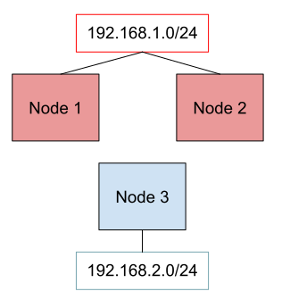
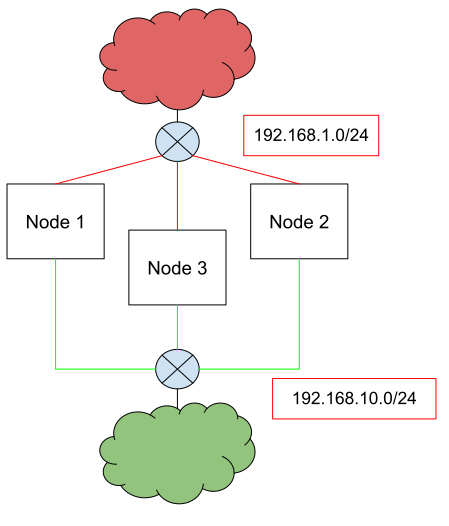
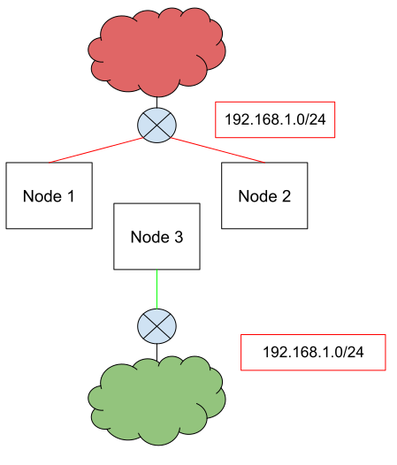

# MetalLB configuration options

## Summary

Following @johananl's initiative in [this issue](https://github.com/metallb/metallb/issues/630)
this enhancement tries to collect and classify various configuration enhancement requests
requested over time.

## Motivation

The way advanced users consume MetalLB is evolving and exposed a need for more complex configuration.
For example, the need for isolation and multi-tenancy induced requests for being able to advertise some specific address pools from a subset of the nodes, or
to allocate them only to a specific namespace, to mention some.

As part of the discussion over an initial version of this proposal we also decided to rethink the MetalLB datamodel, in order to separate the different concerns
handled by MetalLB. This separation is intended to be implemented dropping the configmap support and using Kubernetes CRDs.

### Goals

* Collect and classify all the requests coming from different issues, in order to have a better understanding
  and an organic implementation, avoiding focus on and implementation of only a specific feature, risking causing conflicts afterwards.
* Provide a list of the possible configuration enhancements and highlight dependencies and conflicts among them (if any).
* Highlight the cases where the solution must be BGP or L2 specific
* Provide a new version of the datamodel, splitting the configuration in different resources responsible to address different concerns, and
use that as a base for the new configuration degrees proposed in this document.

### Non-Goals

* Covering only a specific use case.
* Providing a L2 only or BGP only solution where the problem might be expressed in a more generic way.

## New data model

Before addressing the new concerns, we will propose a new scheme for configuring MetalLB, which will be used as a starting point
in the following parts of the proposal. For this reason, it makes sense to have it described in this proposal instead of a separate one.

The new data model will be expressed in terms of kubernetes CRDs, deprecating the configuration via the metallb's ConfigMap.

In the new data model, the following entities will be defined (more details on the implementation section):

* `IPAddressPool`, responsible of the ip allocation to services
* `L2Advertisement`, describing the intention to advertise an IP coming from an `IPAddressPool` via L2
* `BGPAdvertisement`, describing the intention to advertise a prefix coming from an `IPAddressPool` via BGP
* `BGPPeer`, representing an external BGP peer willing to interact with MetalLB

### A note on the IPAddressPool name

One of the goals is to maintain backward compatibility between the CRDs currently implemented in the operator, and the new version.

With that in mind, the current v1beta1.AddressPool would be mapped to an `IPAddressPool` and an `L2Advertisement` or a `BGPAdvertisement`, depending
on the protocol. Because of this 1 to many relationship, conversion webhooks can't be used, and we need to handle both the old and the new version
in the controller. In order to achieve that, the two versions must have different names.

## Configuration Flexibility Proposal

For all the IPs belonging to an address pool, we need to address three main configuration degrees:

* Announcing the IP from a subset of nodes
* Announcing the IP to a subset of BGP neighbors
* Using a given IPAddressPool only for a subset of services

### Announcing the IP from a subset of nodes

The most common request is being able to associate a given pool to a subset of nodes (which translates to selecting a subset of speakers so that these speakers - and only them - announce the IP).

This covers use cases where different set of nodes are exposed to different subnets, and the loadbalancer IP can be reached only via a subset of the nodes.

[](./images/ip_per_node.svg)

This was raised in the following issues / PRs:

* [Issue: L2 Mode on k8s workers on different L2 segments](https://github.com/metallb/metallb/issues/511)
* [PR: Address Pool with node selector filtering](https://github.com/metallb/metallb/pull/502)
* [Issue: Layer 2: impossible to use MetalLB on a subset of Kubernetes nodes](https://github.com/metallb/metallb/issues/302)
* [Issue: Layer2 Different subnets(label for LB, check for interface](https://github.com/metallb/metallb/issues/737)
* [Issue: Look into a generic pool <> node affinity mechanism](https://github.com/metallb/metallb/issues/630)
* [PR: MetalLB speakers working on a subset of nodes in layer2](https://github.com/metallb/metallb/pull/613)
* [Issue: Annotate nodes with address pool/weighted address pools](https://github.com/metallb/metallb/issues/941)

### Announcing the IP to a subset of BGP neighbors

With the exception of the BGP peer [node selector](https://metallb.universe.tf/configuration/#limiting-peers-to-certain-nodes), an IP assigned to a Service
is currently advertised to all the configured BGP peers.

This is described in:

* [Issue: BGP peers per address-pool](https://github.com/metallb/metallb/issues/521)
* [PR: Limit announcement of address pools to specific BGP peers](https://github.com/metallb/metallb/pull/596)

Given the IP, here we want to choose what BGP peers it must be announced to:

[](./images/pool_peer_selector.svg)

On top of that, different nodes must announce the IP to a different set of BGP peers:

[](./images/pool_peer_node_selector.svg)

#### No announcement

This a degenerate case that was suggested by [this discussion](https://github.com/metallb/metallb/pull/832#issuecomment-888897400) where
there are scenarios in which only the IP pooling side of metallb is used, but the routes to those IPs are set statically.

On top of that, Calico suggests to deploy MetalLB without the speakers to leverage only the allocation feature exposed by the controller in
[its official documentation](https://docs.projectcalico.org/networking/advertise-service-ips).

### Using a given IPAddressPool only for a subset of services

Currently, the options to make sure a given service is using a specific IP from a specific pool are:

* using the `metallb.universe.tf/address-pool` annotation on the service
* using the `auto-assign: false` parameter on the pool, and then statically assign the IP to a given service.

From this point of view, we can enhance the allocation logic allowing users to reserve a given pool for a set of namespaces or for a set
of services. This is more flexible and moves the focus on the cluster administrator, who is setting the MetalLB configuration
in a multi tenant scenario.

This, in combination with the other configuration degrees above, will provide a way to have per service (or per namespace) behavior
 (i.e. specifying the communities for a given service).

The issues related to this arguments:

* [Issue: Pool affinity for Namespace](https://github.com/metallb/metallb/issues/383)
* [Issue: Feature request: addresses assignment outside of Service definition](https://github.com/metallb/metallb/issues/616)
* [Issue: allow selecting services to announce with the bgb speaker](https://github.com/metallb/metallb/issues/604)
* [Issue: Dynamic BGP communities from services](https://github.com/metallb/metallb/issues/934)

### Risks and Mitigations

#### Regressions

The e2e test suite is wide enough to ensure we have good coverage on metallb's main features. Given the new data model will be functionally equivalent
to the old one, converting the test suite should give us enough confidence in that regard.

#### Impact on the users' configurations

Deprecating the configmap will have impact on the users' current configurations. To mitigate this, we may consider having a controller that converts the configmap
into the CRDs, or provide some offline tool in charge of that (the latter option is more desirable, as it will remove the need of reconciling changes into the configmap).

#### Impact on users currently using the MetalLB operator

The operator already exposes CRDs, mapped directly to the current configmap entitites.
Changing the CRDs layout will impact them, and in order to mitigate the behaviour, conversion webhooks will be implemented to support both the old and the new versions
of the API, until the old version is deprecated.

#### Bad configurations

##### Service allocation

When a user specifies both a pool to be allocated to a specific service and a pool with no selector, the service may unintentionally receive an IP from the pool which has no selector. We need to implement an easy to understand and deterministic behaviour (see design details below).

##### Non overlapping filters

Having an IP with no nodes advertising it is a risk. Some scenarios are:

* Traffic Policy Local with pods not running on the same nodes selected by the selector
* Node BGP peer selector with no intersection with the address selector

It should be possible to detect non overlapping configurations, and raise an event when they happen. The metallb operator introduces a Validation WebHook
that can be used to prevent those configurations from being created in first instance.

### Conflicts with discovery

The peer discovery feature currently being implemented in [this PR](https://github.com/metallb/metallb/pull/593) will introduce a way to
fetch peers from the node's annotations.

With this new structure, the PR will need to be adjusted to extend the `BGPPeer` entity in order to consume the node's annotations instead of hardcoded values.

With the introduction of CRDs, external entities (such as a Cloud Controller Manager) would be able to create MetalLB CRs instead of enriching Node objects. In
that scenario, the autodiscovery effort would not be needed.

### Conflicts with the FRR implementation

All the BGP changes will happen from a "behavioural" point of view. Where needed, the changes will be reflected in both the native and the new implementation.

### Not covering all the angles

The risk of not covering all possible cases / permutations is still there.

That aside, this proposal covers the majority of the issues that were raised by the users (multiple times), and it won't prevent adding a finer level of configuration
if the need ever arises. Moreover, providing a straightforward way to separate concerns will make it easier to accomodate new changes, and it will be more clear where
those new changes must be applied.

## Design Details

### New data model

Here we describe the new proposed data model in the form of Go structures, and non comprehensive sample CRDs.

#### IPAddressPool

The `IPAddressPool` is the entity responsible for the IP allocation part, regardless of how (and if) the ip is going to be advertised.

Hence, we keep the same structure but remove the bgpAdvertisement section and the Protocol field.

```go
type IPAddressPool struct {
  Name              string
  Addresses         []string
  AvoidBuggyIPs     bool
  AutoAssign        *bool
}
```

Example CR:

```yaml
apiVersion: metallb.io/v1beta1
kind: IPAddressPool
metadata:
  name: ipaddresspool-sample3
  namespace: metallb-system
spec:
  addresses:
    - 2002:2:2::1-2002:2:2::100
    - 172.20.0.100/24
  autoAssign: false
  avoidBuggyIPs: true

```

#### BGP Advertisement

The `BGPAdvertisement` entity represents the intention to advertise a given IP via the BGP Protocol. It contains properties related to the type of advertisement and a reference to the address pools we want we advertise. This initial version matches the current behaviour, where an IP is advertised to all the `BGPPeer`s configured in MetalLB.

```go
type bgpAdvertisement struct {
  Name                     string
  IPAddressPools           []string
  IPAddressPoolSelector    *metav1.LabelSelector
  AggregationLength        *int
  LocalPref                *uint32
  Communities              []string
}
```

Example CR:

```yaml
apiVersion: metallb.io/v1beta1
kind: BGPAdvertisement
metadata:
  name: bgpadvertisement
  namespace: metallb-system
spec:
    ipaddresspools:
      - pool1
      - pool2
    - communities:
        - 65535:65282
    aggregationLength: 32
    localPref: 100
```

A `BGPAdvertisement` with no pool selector is intended to select all the available `IPAddressPool`s.

#### L2 Advertisement

The `L2Advertisement` entity represents the intention to advertise a given IP via L2. Currently, there are no knobs related to L2 advertisement.

```go
type l2Advertisement struct {
  Name                     string
  IPAddressPools           []string
  IPAddressPoolSelector    *metav1.LabelSelector
}
```

Example CR:

```yaml
apiVersion: metallb.io/v1beta1
kind: L2Advertisement
metadata:
  name: l2advertisement
  namespace: metallb-system
spec:
    ipaddresspools:
      - pool1
      - pool2
```

A `L2Advertisement` with no pool selector is intended to select all the available `IPAddressPools`s.

### BGP Peer

The `BgpPeer` entity represents an external BGP peer we want to establish a session with. It contains the properties of the sessions, and it's a 1:1 mapping of the current bgp peer structure without the node selector. We also add the `bfdProfile` structure here, as it is part of the session definition.

Note that the node selector field represent the intention to connect to a given peer only from a subset of the nodes.

```go
type bgpPeer struct {
  Name              string
  MyASN             uint32
  ASN               uint32
  Addr              string
  SrcAddr           string
  Port              uint16
  HoldTime          string
  KeepaliveTime     string
  RouterID          string
  Password          string
  BFDProfile        string
  EBGPMultiHop      bool
  NodeSelector      *metav1.LabelSelector
  SecretPassword    corev1.SecretRef
}

type bfdProfile struct {
  Name             string  
  ReceiveInterval  *uint32 
  TransmitInterval *uint32 
  DetectMultiplier *uint32 
  EchoInterval     *uint32 
  EchoMode         bool    
  PassiveMode      bool    
  MinimumTTL       *uint32 
}
```

Example CRs:

```yaml
apiVersion: metallb.io/v1beta1
kind: BGPPeer
metadata:
  name: peer-bfd
  namespace: metallb-system
spec:
  peerAddress: 10.0.0.2
  peerASN: 64501
  myASN: 64500
  routerID: 10.10.10.10
  peerPort: 1
  holdTime: "10s"
  sourceAddress: 1.1.1.1
  bfdProfile: bfdprofilefull

apiVersion: metallb.io/v1beta1
kind: BFDProfile
metadata:
  name: bfdprofilefull
  namespace: metallb-system
spec:
  receiveInterval: 35
  transmitInterval: 35
  detectMultiplier: 37
  echoReceiveInterval: 38
  echoTransmitInterval: 39
  echoMode: true
  passiveMode: true
  minimumTtl: 10
```  

The `SecretPassword` field is mutually exclusive with the `Password` field, and contains a reference to a secret containing the
password to use. Setting both fields will result in a failure of the parsing.

### New configuration degrees

#### Announcing the IP from a subset of nodes

The two Advertisement entities are extended with a selector of the nodes to announce from:

A configuration would look like:

```go
type bgpAdvertisement struct {
  Name                     string
  IPAddressPools           []string
  IPAddressPoolSelector    *metav1.LabelSelector
  AggregationLength        *int
  LocalPref                *uint32
  Communities              []string
  NodeSelector             *metav1.LabelSelector
}
```

```go
type l2Advertisement struct {
  Name              string
  NodeSelector      *metav1.LabelSelector
}
```

```yaml
apiVersion: metallb.io/v1beta1
kind: BGPAdvertisement
metadata:
  name: bgpadvertisement
  namespace: metallb-system
spec:
    ipaddresspools:
      - pool1
      - pool2
    nodeSelector:
    - matchExpressions:
      - key: kubernetes.io/hostname
        operator: In
        values: [hostA, hostB]
```

```yaml
apiVersion: metallb.io/v1beta1
kind: L2Advertisement
metadata:
  name: l2advertisement
  namespace: metallb-system
spec:
    ipaddresspools:
      - pool1
      - pool2
    nodeSelectors:
    - matchExpression:
      - key: kubernetes.io/hostname
        operator: In
        values: [hostA, hostB]
```

#### Announcing the IP to a subset of BGP neighbors

This concern is now addressed by adding a peers selector to the `BGPAdvertisement` entity.
By using both the pools and the peers selector, it will be possible to declare the intent of announcing the IPs of a given `IPAddressPool` only to a subset of BGP peers,
and only from a subset of nodes.

```go
type bgpAdvertisement struct {
  Name                     string
  IPAddressPools           []string
  Peers                    []string
  IPAddressPoolSelector    *metav1.LabelSelector
  PeerSelector             *metav1.LabelSelector
  AggregationLength        *int
  LocalPref                *uint32
  Communities              []string
}
```

Example CR:

```yaml
apiVersion: metallb.io/v1beta1
kGPd: BGPAdvertisement
metadata:
  name: bgpadvertisement
  namespace: metallb-system
spec:
    ipaddresspools:
      - pool1
      - pool2
    peers:
      - peer1
      - peer2
    - communities:
        - 65535:65282
    aggregationLength: 32
    localPref: 100
```

#### Not announcing the IP

This concern will be addressed by defining an IPAddressPool not referenced by any Advertisement instance.

#### Using a given IPAddressPool only for a subset of services

The idea is to be able to reduce the scope of a particular IPAddressPool to a set of namespaces and services, by adding an optional namespace / service selector.

```go
type IPAddressPool struct {
  Name              string
  Addresses         []string
  AvoidBuggyIPs     bool
  AutoAssign        *bool
  AllocateTo        serviceAllocation
}

type serviceAllocation struct {
  Priority          int
  Namespaces        []string
  NamespaceSelector *metav1.LabelSelector
  ServiceSelector   *metav1.LabelSelector
}
```

Example CR

```yaml
apiVersion: metallb.io/v1beta1
kind: IPAddressPool
metadata:
  name: ipaddresspool-sample3
  namespace: metallb-system
spec:
  addresses:
    - 2002:2:2::1-2002:2:2::100
    - 172.20.0.100/24
  autoAssign: false
  avoidBuggyIPs: true
  allocateTo:
    priority: 50
    namespaces:
      - namespaceA
      - namespaceB
    serviceSelector:
        tenant: foo
```

The controller will use the pool with lowest value of priority in case of multiple matches. This is deterministic and will make the behaviour more clear to the users.

A pool with no priority set will be used only if the pools with priority can't be used.

Given a Service, if multiple matching `IPAddressPool`s are available MetalLB will check for the availability of IPs sorting the matching `IPAddressPool`s by priority, starting from the highest to the lowest. If multiple `IPAddressPool`s have the same priority, the choice will be random.

### Test Plan

#### E2e tests

In order to ensure no regressions in terms of functionality, all the current E2E tests must be converted and adapted to the new data model.

Every new configuration must be reflected in additional e2e tests that ensure MetalLB is handling the new configuration properly.

#### Unit tests

The code must be covered by unit tests. Especially the selection logic, to have a broader coverage and to understand if the logic is working.

## Drawbacks

This new logic may bring broader complexity while MetalLB is well known to work out of the box.

Besides that, all the additional selectors are optional, and the bare minimum configuration will continue to work.
Power users will be able to leverage this extra configurability for their more complex scenarios.

## Development Phases

### New Data Model

We expect two phases, moving the CRDs as they are from the metallb operator to metallb first, and changing the data model later.

#### CRD migration

The CRDs will be moved from the MetalLB operator to MetalLB as they are. The tests already have a "CRD" mode that will
make sure there are no (or limited :P) regressions.

The configmap will be deprecated.

The CRDs are removed from the operator, which is in charge of deploying metallb only.

#### CRD evolution

During the new data model implementation (described in the "New Data Model" section), the e2e tests will be adjusted to use the new data model, and eventually a converter (like the one for configmap mode / crd mode)
will be implemented to guarantee both the old and the new versions keep working.

Conversion webhooks will be put in place to guarantee backward compatibility for the current users of the MetalLB Operator.

### New configuration degrees

The remaining configuration degrees seem now to be independent:

* BGPAdvertisement peers selector
* L2Advertisement node selector
* BGPAdvertisement node selector
* IPAddressPool namespace / service selector

For this reason, from a development point of view they can be implemented in parallel / one at the time.

In order to declare a given configuration option fully supported, the following items must be covered:

* implementing the feature
* adding test coverage
* extending the documentation
