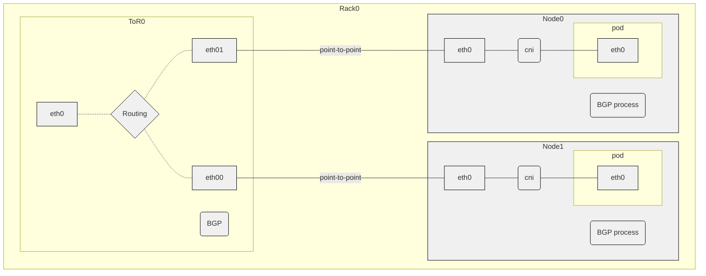
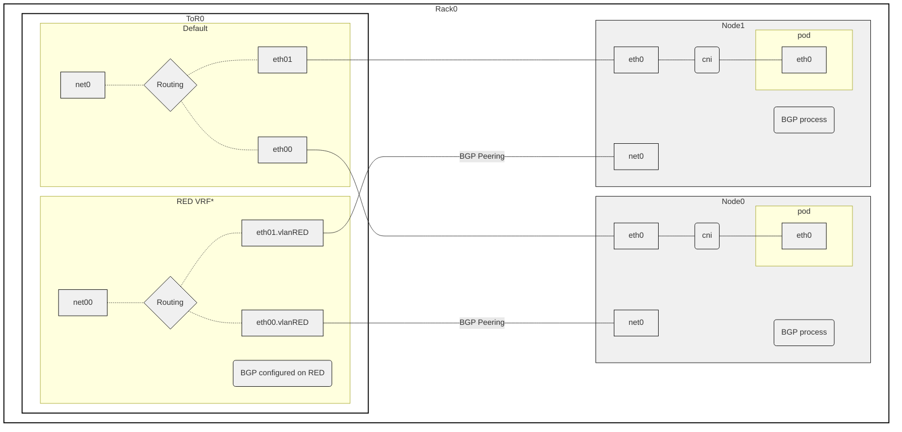

# MetalLB support for BGP Unnumbered

## Summary

BGP Unnumbered allows routers to peer with each other when direct connected
without the need for IPs (the BGP configuration uses interface names). Once
peering takes places, exchange IPv4 or IPv6 prefixes can take place. That
feature can be used by MetalLB to simplify configuration both on the network
fabric and on the cluster side.

## Motivation

Using BGP unnumbered peering, which dynamically discovers IPV6 neighbors,
reduces the burden of the network administrator to configue all
interfaces on the network fabric or on the cluster nodes to have IPv4
addressing just for the BGP peering. By using BGP unnumbered, cluster administrator
avoids to specify the address of each neihbor. Unnumbered BGP utilizes IPv6
link local address to automatically decide which peer to connect to.

## Limitation/Requirements

- To use unnumbered BGP feature, there must be a link (point-to-point, directly
  connected) between the interfaces two BGP speakers are using
- IPv6 must be enabled on that interfaces, and with LLA (Link Local IPv6 Address) enabled.
  Note: the use of IPv6 LLA does not require a full IPv6 deployment
- IPv6 RAs (Router Advertisments) must be enabled (it should be safe when p2p and no IP address on the interface).

## Goals

- Make the BGP peering from Server to the ToR (TopOfRack) easier to configure
  and have the same configuration for all servers (assuming the interfaces' names
  are the same across the cluster nodes)
- Remove the task of network admins to setup up addressing on those interfaces
  if it is needed only for BGP peering

## Non Goals

- Make it work over no point-to-point connection
- Define/Discuss dual ToR architecture, on top of bond interfaces or other HA strategies
- [Dynamic BGP Peering](https://ipwithease.com/dynamic-bgp-peering/) is a
  feature different than unnumbered BGP. Both feature reduce the configuration
  needed for the BGP peering. The main difference is that Dynamic BGP peering
  still needs IP addresses and does not require point-to-point links.

## User Stories

### Story 1

As cluster administrator, I want to configure metallb without configuring IP addresses.

### Story 2

As network administrator, I want to avoid configuring IP addresses for
point-to-point connection just for the BPG peering reason.

### Story 3

As network administrator, I want to reduce the size of the configuration in the ToR router.

## The API Changes

A new field will be introduced, `Interface string` which if defined then Unnumber
BGP takes place. In that case, the address must NOT have value. The API doc will
look like:

```
Interface, if defined, instructs Metallb to setup Unnumber BGP peering on the interface,
which means that the peering configuration only includes the interface and does
not include IP address. Address and Interface are mutually exclusive and one of
them must be specified.
```

#### FRR-K8S

```go
type Neighbor struct {
  Address string `json:"address"`
  Interface string `json:"interface"`
}
```

##### MetalLB

```go
type BGPPeerSpec struct {
  Address string `json:"peerAddress"`
  Interface string `json:"interface"`
}
```

Example CR

```yaml
apiVersion: metallb.io/v1beta2
kind: BGPPeer
metadata:
  name: peer-unnumber
  namespace: metallb-system
spec:
  myASN: 64512
  ASN: 645000
  interface: net0
```

#### Rejected Alternative - Re-Use Address field

We can re-use `Address string` to either be IP or interface, if not valid IP we
indicate Unnumbered BGP peering. This looks the minimal API, but it will not
have clean error path. E.g. if the user input is not a valid IP, the
implementation will shadow all the existing errors and will fail in the
runtime.

#### Rejected Alternative - Add new Unnumber bool field

We can introduce a new field `Unnumber bool`, which if true the we indicate
Unnumber BGP Peering. If `true` the Address field holds the interface value.
Bool option makes the configuration error-free, because the user declares
explicitly that they want Unnumber and there is no "guessing" what metallb
does. Unnumber case is disconnected from LLA support case.

### Design details

To make unnumber BGP work, we need to modify the neighborsession
as defined in the following template [neighborsession.tmpl](internal/bgp/frr/templates/neighborsession.tmpl)
and make the following changes

1. Every time there is FRR directive that uses the address, to use the
   interface name

```
before:  neighbor 192.168.10.10 timers 180 540
after:  neighbor net0 timers 180 540
```

2. The `remote-as` directive must be replaced

```
before: neighbor 192.168.10.10 remote-as 65004
after: neighbor net0 interface remote-as 65004
```

3. There is currently a single directive that does not accept interface.
   Therefore it must be always excluded.

```
neighbor {{.neighbor.Addr}} disable-connected-check
```

### Topics

#### IPv6 RAs (Route Advertisments) enabled on both ends of the link

According to the design of unnumber BGP peering, we need to enable RAs. By
observation it seems that FRR/Zebra component is auto-enabling RAs when the BGP
unnumber session is configured. This is the [commit](https://github.com/FRRouting/frr/commit/4a04e5f7968d46e446bdb530724da18b90b7f5f8).
Therefore the Metallb implementation does not require that RAs are explicitly
enabled in the FRR config unless we have other reasons (e.g. have different period).

#### Do I need an IPv{4,6} to enable dataplane traffic

There is no need for the interface to have an IP in order the BGP
session to be established. This is the core of unnumber BGP. Nevertheless,
when doing BGP peering between a non-router component and a route, then an IP
might be needed for the dataplane traffic to work.

**Note:** the rest of the section is outside the scope of Metallb and is related
to the CNI that cluster is being using. We discuss it as that might be important.

##### Ingress traffic to LB IP and BGP route learning

When external client (outside peer router) talks to an LB address and there is BGP route learning
(= local k8s nodes adds routing from peer) **there is no need for an IP**

```
# packet in/out of k8s node
net0  In  IP 200.100.100.1.40524 > 5.5.5.5.80: Flags [S], seq 1203290349,
veth3e626b76 Out IP 200.100.100.1.40524 > 10.244.2.4.80: Flags [S], seq 1203290349,
veth3e626b76 In  IP 10.244.2.4.80 > 200.100.100.1.40524: Flags [S.], seq 3181148864, ack 1203290350,
net0  Out IP 5.5.5.5.80 > 200.100.100.1.40524: Flags [S.], seq 3181148864, ack 1203290350,

# k8s node
kind-worker:/# ip --br add show
    lo               UNKNOWN        127.0.0.1/8 ::1/128
    veth2c551257@if2 UP             10.244.2.1/32 fe80::1498:dbff:fe25:6e1b/64
    eth0@if325       UP             172.20.20.4/24 2001:172:20:20::4/64 fe80::42:acff:fe14:1404/64
    eth1@if330       UP             172.18.0.3/16 fc00:f853:ccd:e791::3/64 fe80::42:acff:fe12:3/64
    net0@if3         UP             fe80::dcad:beff:feff:1161/64
kind-worker:/# ip route
    default via 172.20.20.1 dev eth0
    10.244.0.0/24 via 172.20.20.3 dev eth0
    10.244.1.0/24 via 172.20.20.2 dev eth0
    10.244.2.3 dev veth2c551257 scope host
    172.18.0.0/16 dev eth1 proto kernel scope link src 172.18.0.3
    172.20.20.0/24 dev eth0 proto kernel scope link src 172.20.20.4
    172.30.0.0/16 via 172.20.20.6 dev eth0
    200.100.100.0/24 nhid 68 via inet6 fe80::2c5f:eff:fec4:cf7b dev net0 proto bgp metric 20
kind-worker:/# ip route get 200.100.100.1
    200.100.100.1 via inet6 fe80::2c5f:eff:fec4:cf7b dev net0 src 172.20.20.4 uid 0
        cache
```
That works as long as the NAT/Masq rule properly sets back the source IP to be the LB
which depends at the end of the CNI/use or not kube-proxy.

##### Ingress traffic to LB IP and static routes

This does NOT work without IP on the interface. Even if route is configured
with the interface `ip route add 200.100.100.0/24 dev net0` the traffic breaks
due to ARP.

```
net0  In  IP 200.100.100.1.43198 > 5.5.5.5.80: Flags [S], seq 3169002768,
veth3e626b76 Out IP 200.100.100.1.43198 > 10.244.2.4.80: Flags [S], seq 3169002768,
veth3e626b76 In  IP 10.244.2.4.80 > 200.100.100.1.43198: Flags [S.], seq 490740861, ack 3169002769,
net0  Out ARP, Request who-has 200.100.100.1 tell 172.20.20.4, length 28
net0  Out ARP, Request who-has 200.100.100.1 tell 172.20.20.4, length 28
```

[RFC 8950](https://datatracker.ietf.org/doc/html/rfc8950) explains why we do not need ARP in previous case.

##### Egress traffic to LB IP and BGP route learning

When pod in a node that has the routing entry due BGP peering
```
kind-worker:/# ip route
    200.100.100.0/24 nhid 68 via inet6 fe80::2c5f:eff:fec4:cf7b dev net0 proto bgp metric 20
kind-worker:/# ip route get 200.100.100.1
    200.100.100.1 via inet6 fe80::2c5f:eff:fec4:cf7b dev net0 src 172.20.20.4 uid 0
kind-worker:/# ip a s eth0
324: eth0@if325: <BROADCAST,MULTICAST,UP,LOWER_UP> mtu 1500 qdisc noqueue state UP group default
    link/ether 02:42:ac:14:14:04 brd ff:ff:ff:ff:ff:ff link-netnsid 0
    inet 172.20.20.4/24 brd 172.20.20.255 scope global eth0
       valid_lft forever preferred_lft forever
```
initiates a connection to the outside, the source IP of the packet is one of the other interfaces.
What is the selection algorithm is unclear and kernel documentation could
answer. The important information is that if IP address is added in the
loopback interface, then that IP address is being used. There is not need for
an IP in the peer interface.

```
kind-worker:/# ip a s lo
1: lo: <LOOPBACK,UP,LOWER_UP> mtu 65536 qdisc noqueue state UNKNOWN group default qlen 1000
    link/loopback 00:00:00:00:00:00 brd 00:00:00:00:00:00
    inet 127.0.0.1/8 scope host lo
       valid_lft forever preferred_lft forever
    inet 12.12.12.12/32 scope global lo
       valid_lft forever preferred_lft forever
    inet6 ::1/128 scope host
       valid_lft forever preferred_lft forever
kind-worker:/# ip route get 200.100.100.1
200.100.100.1 via inet6 fe80::cc61:c8ff:fefc:2dce dev net0 src 12.12.12.12 uid 0
    cache
```
So the answer is IP address is needed, but configuring IP address in the loopback is enough
to control it.

##### Egress traffic to LB IP and static routes

The interface needs IP address to setup source IP address and routing.

## Test Plan

### E2E test for {i,E}Unnumbered on primary interface




There is no straightforward way to test unnumbered in the primary node
interface. The testing setup (kind creation) creates bridge and connect
containers. Ideally we need to setup a kind cluster, and replace the bridge
with a container that runs FRR on each other side of the veth, and at the same
time to provide switch/upstream. Until we find a way to automate that infra setup
we will test that scenario manually.

### E2E test for Unnumbered on secondary interface



We should modify the testing infra to include point-to-point links which means
connect containers using VETH, and not through a bridge. We need NET-ADMIN cap
(or sudo) when creating the VETH.

#### Option 1 - have a separate test

We could have an isolated test file that creates/deletes peer per that specific tests.
In that option we do not to take resources from runners outside the runtime of
the test. This new peering setup needs different configuration (not IPs but interface
names) and therefore avoid extensive(?) refactoring of the help functions.

#### Option 2 - extend the FRR Containers and have all test run on top

Benefit of that would be that we will cover all the feature/scenarios (e.g. uncordon node).
Reason not to do that would be add extra time, create many skip rules (e.g. if Multihop skip that Peer),
extensive(?) refactor of the test functions.

### An example ToR configuration when based on FRR

This how the testing is setup, and how we emulate a ToR Switch/Router

```
frr defaults datacenter
hostname tor
no ipv6 forwarding
!
interface eth00
    ipv6 nd ra-interval 10
    no ipv6 nd suppress-ra
exit
!
interface eth01
    ipv6 nd ra-interval 10
    no ipv6 nd suppress-ra
exit
!
interface lo
    ip address 200.100.100.1/24 //for testing
exit
!
router bgp 65001
    bgp router-id 11.11.11.254
    neighbor MTLB peer-group
    neighbor MTLB passive
    neighbor MTLB remote-as external
    neighbor MTLB description LEAF-MTLB
    neighbor eth00 interface peer-group MTLB
    neighbor eth01 interface peer-group MTLB
    !
    address-family ipv4 unicast
        redistribute connected
        neighbor MTLB activate
    exit-address-family
    !
    address-family ipv6 unicast
        redistribute connected
        neighbor MTLB activate
    exit-address-family
    exit
```

### How a peering will look like

```
> docker exec -it unnumbered-p2p-peer vtysh -c 'show bgp summary'

IPv4 Unicast Summary (VRF default):
BGP router identifier 11.11.11.254, local AS number 65004 vrf-id 0
BGP table version 4
RIB entries 3, using 288 bytes of memory
Peers 3, using 39 KiB of memory
Peer groups 1, using 64 bytes of memory

Neighbor                  V         AS   MsgRcvd   MsgSent   TblVer  InQ OutQ  Up/Down State/PfxRcd   PfxSnt Desc
kind-control-plane(eth00) 4      65000       510       510        4    0    0 00:24:43            1        2 k8s-node
kind-worker(eth01)        4      65000       510       510        4    0    0 00:24:43            1        2 k8s-node
kind-worker2(eth02)       4      65000       510       510        4    0    0 00:24:43            1        2 k8s-node

Total number of neighbors 3

IPv6 Unicast Summary (VRF default):
BGP router identifier 11.11.11.254, local AS number 65004 vrf-id 0
BGP table version 3
RIB entries 1, using 96 bytes of memory
Peers 3, using 39 KiB of memory
Peer groups 1, using 64 bytes of memory

Neighbor                  V         AS   MsgRcvd   MsgSent   TblVer  InQ OutQ  Up/Down State/PfxRcd   PfxSnt Desc
kind-control-plane(eth00) 4      65000       510       510        3    0    0 00:24:43            1        1 k8s-node
kind-worker(eth01)        4      65000       510       510        3    0    0 00:24:43            1        1 k8s-node
kind-worker2(eth02)       4      65000       510       510        3    0    0 00:24:43            1        1 k8s-node


> k -n metallb-system exec -it -c frr frr-k8s-daemon-kzpz2 -- vtysh -c 'show bgp summary'

IPv4 Unicast Summary (VRF default):
BGP router identifier 172.19.0.3, local AS number 65000 vrf-id 0
BGP table version 2
RIB entries 3, using 288 bytes of memory
Peers 1, using 13 KiB of memory
Peer groups 1, using 64 bytes of memory

Neighbor                  V         AS   MsgRcvd   MsgSent   TblVer  InQ OutQ  Up/Down State/PfxRcd   PfxSnt Desc
unnumbered-p2p-peer(net0) 4      65004       512       512        2    0    0 00:25:15            1        2 TOR

Total number of neighbors 1

IPv6 Unicast Summary (VRF default):
BGP router identifier 172.19.0.3, local AS number 65000 vrf-id 0
BGP table version 1
RIB entries 1, using 96 bytes of memory
Peers 1, using 13 KiB of memory
Peer groups 1, using 64 bytes of memory

Neighbor                  V         AS   MsgRcvd   MsgSent   TblVer  InQ OutQ  Up/Down State/PfxRcd   PfxSnt Desc
unnumbered-p2p-peer(net0) 4      65004       512       512        1    0    0 00:25:15            0        1 TOR

Total number of neighbors 1

> docker exec -it unnumbered-p2p-peer vtysh -c 'show bgp ipv4'
BGP table version is 3, local router ID is 11.11.11.254, vrf id 0
Default local pref 100, local AS 65004
Status codes:  s suppressed, d damped, h history, * valid, > best, = multipath,
               i internal, r RIB-failure, S Stale, R Removed
Nexthop codes: @NNN nexthop's vrf id, < announce-nh-self
Origin codes:  i - IGP, e - EGP, ? - incomplete
RPKI validation codes: V valid, I invalid, N Not found

    Network          Next Hop            Metric LocPrf Weight Path
 *= 5.5.5.5/32       eth02                    0             0 65000 i
 *=                  eth01                    0             0 65000 i
 *>                  eth00                    0             0 65000 i
 *> 200.100.100.0/24 0.0.0.0(unnumbered-p2p-peer)
                                             0         32768 ?

Displayed  2 routes and 4 total paths
> docker exec -it unnumbered-p2p-peer ip route
5.5.5.5 nhid 21 proto bgp metric 20
        nexthop via inet6 fe80::dcad:beff:feff:1160 dev eth00 weight 1
        nexthop via inet6 fe80::dcad:beff:feff:1161 dev eth01 weight 1
        nexthop via inet6 fe80::dcad:beff:feff:1162 dev eth02 weight 1
```

## Links

- [BGP in the Data Center](https://www.oreilly.com/library/view/bgp-in-the/9781491983416/)
- [blog](https://blog.ipspace.net/2022/11/bgp-unnumbered-duct-tape/)
- [srlinux](https://documentation.nokia.com/srlinux/22-6/SR_Linux_Book_Files/Configuration_Basics_Guide/configb-bgp.html)
- [cilium e2e](https://docs.cilium.io/en/stable/contributing/development/bgp_cplane/#bgp-cplane-contributin)
