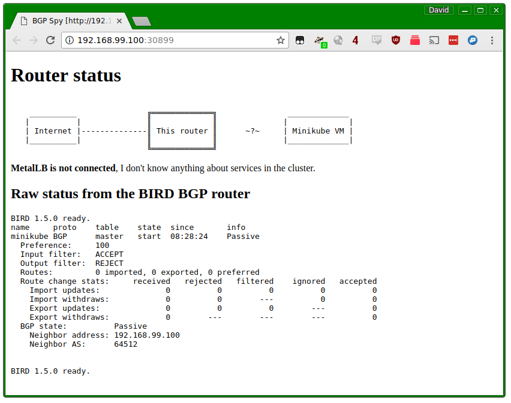
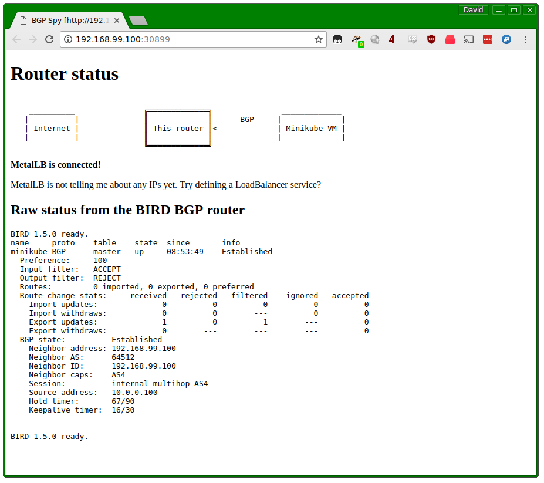

# Tutorial

In this tutorial, we'll set up a BGP router in Minikube, configure
MetalLB to use it, and create some load-balanced services. We'll be
able to inspect the BGP router's state, and see that it reflects the
intent that we expressed in Kubernetes.

Because this will be a simulated environment inside Minikube, this
setup only lets you inspect the router's state and see what it _would_
do in a real deployment. Once you've experimented in this setting and
are ready to set up MetalLB on a real cluster, refer to
the [installation guide]() for instructions.

Here is the outline of what we're going to do:
1. Set up a Minikube cluster,
2. Set up a mock BGP router that we can inspect in subsequent steps,
3. Install MetalLB on the cluster,
4. Configure MetalLB to peer with our mock BGP router, and give it some IP addresses to manage,
5. Create a load-balanced service, and observe how MetalLB sets it up,
6. Change MetalLB's configuration, and fix a bad configuration,
7. Tear down the playground.

# Set up a Minikube cluster

If you don't already have a Minikube cluster set up, follow
the
[instructions](https://kubernetes.io/docs/getting-started-guides/minikube/) on
kubernetes.io to install Minikube and get your playground cluster
running. Once you've done so, you should be able to run `minikube
status` and get output that looks something like this:

```
minikube: Running
cluster: Running
kubectl: Correctly Configured: pointing to minikube-vm at 192.168.99.100
```

# Set up a mock BGP router

MetalLB exposes load-balanced services using the BGP routing protocol,
so we need a BGP router to talk to. In a production cluster, this
would be set up as a dedicated hardware router (e.g. an Ubiquiti
EdgeRouter), or a soft router using open-source software (e.g. a Linux
machine running the [BIRD](http://bird.network.cz) routing suite).

For this tutorial, we'll deploy a pod inside minikube that runs
BIRD. It will be configured to speak BGP, but it won't configure Linux
to forward traffic based on the data it receives. Instead, we'll just
inspect that data to see what a real router _would_ do.

Deploy this mock router with `kubectl`:

`kubectl apply -f manifests/tutorial-1.yaml`

This will create a deployment for our BGP router, as well as two
cluster-internal services. Wait for the router pod to start, by running `kubectl get pods` until you see the bgp-router pod in the `Running` state:

```
NAME                         READY     STATUS    RESTARTS   AGE
bgp-router-bccb997b6-dvcj6   1/1       Running   0          2m
```

(your pod will have a slightly different name, because the suffix is
randomly generated by the deployment – this is fine.)

In addition to the router pod, the `tutorial-1.yaml` manifest created
two cluster-internal services. The `bgp-router` service will expose
our BGP router at `10.0.0.100`, so that we have a stable IP address
for MetalLB to talk to. The `bgp-spy` service is a little UI that
shows us what the router is thinking.

Let's open that UI now. Run: `minikube service bgp-spy`. This will
open a new browser tab that should look something like this:



If you're comfortable with BGP and networking, the raw BIRD status may
be interesting. If you're not, don't worry, the important part is
above: our router is running, but knows nothing about our Kubernetes
cluster, because MetalLB is not connected.

Obviously, MetalLB isn't connected to our router, it's not installed
yet! Let's address that. Keep the bgp-spy tab open, we'll come back to
it shortly.

# Install MetalLB

MetalLB runs in two parts: a cluster-wide controller, and a
per-machine BGP speaker. Since Minikube is a Kubernetes cluster with a
single VM, we'll end up with the controller and one BGP speaker.

Install MetalLB by applying the manifest:

`kubectl apply -f manifests/metallb.yaml`

This manifest creates a bunch of resources. Most of them are related
to access control, so that MetalLB can read and write the Kubernetes
objects it needs to do its job.

Ignore those bits for now, the two pieces of interest are the
"controller" deployment, and the "bgp-speaker" daemonset. Wait for
these to start by monitoring `kubectl get pods -n
metallb-system`. Eventually, you should see two running pods (again,
the pod name suffixes will be different on your cluster).

```
NAME                          READY     STATUS    RESTARTS   AGE
bgp-speaker-flxtr             1/1       Running   0          33s
controller-74dddf4794-zq69z   1/1       Running   0          33s
```

Refresh the bgp-spy tab from earlier, and... It's the same! MetalLB is
still not connected, and our router still knows nothing about cluster
services.

That's because the MetalLB installation manifest doesn't come with a
configuration, so both the controller and BGP speaker are sitting
idle, waiting to be told what they should do. Let's fix that!

# Configure MetalLB

We have a sample MetalLB configuration in
`manifests/tutorial-2.yaml`. Let's take a look at it before applying
it:

```yaml
apiVersion: v1
kind: ConfigMap
metadata:
  namespace: metallb-system
  name: config
data:
  config: |
    peers:
    - my-asn: 64512
      peer-asn: 64512
      peer-address: 10.0.0.100
    address-pools:
    - name: my-ip-space
      cidr:
      - 198.51.100.0/24
      advertisements:
      - localpref: 100
```

MetalLB's configuration is a standard Kubernetes ConfigMap,
`config` under the `metallb-system` namespace. It contains two
pieces of information: who MetalLB should talk to, and what IP
addresses it's allowed to hand out.

In this configuration, we're setting up a BGP peering with
`10.0.0.100`, which is the IP address of the `bgp-router` service we
created in step 2. And we're giving MetalLB 256 IP addresses to use,
from 198.51.100.0 to 198.51.100.255. The final section gives MetalLB
some BGP attributes that it should use when announcing IP addresses to
our router.

Apply this configuration now:

`kubectl apply -f manifests/tutorial-2.yaml`

The configuration should take effect within a few seconds. Refresh the
bgp-spy browser page again (run `minikube service bgp-spy` if you
closed it and need to get it back). If all went well, you should see a
much happier router:



Success! The MetalLB BGP speaker connected to our router. You can
verify this by looking at the logs for the BGP speaker. Run `kubectl
logs -n metallb-system -l app=bgp-speaker`, and among other log
entries, you should find something like:

```
I1127 08:53:49.118588       1 main.go:203] Start config update
I1127 08:53:49.118705       1 main.go:255] Peer "10.0.0.100" configured, starting BGP session
I1127 08:53:49.118729       1 main.go:270] End config update
I1127 08:53:49.170535       1 bgp.go:55] BGP session to "10.0.0.100:179" established
```

However, as bgp-spy pointed out, MetalLB is connected to our router,
but isn't telling it about any services yet. That's because all the
services we've defined so far are internal to the cluster. Let's
change that!

# Create a load-balanced service

`manifests/tutorial-3.yaml` contains a trivial service: an nginx pod,
and a load-balancer service pointing at nginx. Deploy it to the cluster now:

`kubectl apply -f manifests/tutorial-3.yaml`

Again, wait for nginx to start by monitoring `kubectl get pods`, until
you see a running nginx pod. It should look something like this:

```
NAME                         READY     STATUS    RESTARTS   AGE
bgp-router-bccb997b6-dvcj6   1/1       Running   0          43m
nginx-558d677d68-j9x9x       1/1       Running   0          47s
```

Once it's running, take a look at the `nginx` service with `kubectl get service nginx`:

```
NAME      TYPE           CLUSTER-IP   EXTERNAL-IP    PORT(S)        AGE
nginx     LoadBalancer   10.0.0.29    198.51.100.0   80:32732/TCP   1m
```

We have an external IP! Because the service is of type LoadBalancer,
MetalLB took `198.51.100.0` from the address pool we configured, and
assigned it to the nginx service. You can see this even more clearly by looking at the event history for the service, with `kubectl describe service nginx`:

```
  Type    Reason          Age   From                Message
  ----    ------          ----  ----                -------
  Normal  IPAllocated     24m   metallb-controller  Assigned IP "198.51.100.0"
```

Refresh your bgp-spy page, and see what our router thinks:


Success! MetalLB told our router that 198.51.100.0 exists on our
Minikube VM, and that the router should forward any traffic to that IP
to us.

# Edit MetalLB's configuration

In the previous step, MetalLB assigned the address 198.51.100.0, the
first address in the pool we gave it. That IP address is perfectly
valid, but some old and buggy wifi routers mistakenly think it isn't,
because it ends in `.0`.

As it turns out, one of our customers called and complained of this
exact problem. Fortunately, MetalLB has a configuration option to
address this. Take a look at the configuration in
`manifests/tutorial-4.yaml`:

```yaml
apiVersion: v1
kind: ConfigMap
metadata:
  namespace: metallb-system
  name: config
data:
  config: |
    peers:
    - my-asn: 64512
      peer-asn: 64512
      peer-address: 10.0.0.100
    address-pools:
    - name: my-ip-space
      avoid-buggy-ips: true
      cidr:
      - 198.51.100.0/24
      advertisements:
      -
```

There's just one change compared to our previous configuration: in the
address pool configuration, we added `avoid-buggy-ips: true`. This
tells MetalLB that IP addresses ending in `.0` or `.255` should not be
assigned.

Sounds easy enough, let's apply that configuration:

`kubectl apply -f manifests/tutorial-4.yaml`

Refresh the bgp-spy page and... Hmm, strange, our router is still
being told to use `198.51.100.0`, even though we just told MetalLB
that this address should not be used. What happened?

To answer that, let's inspect the running configuration in Kubernetes,
by running `kubectl describe configmap -n metallb-system
config`. At the bottom of the output, you should see an event
log that looks like this:

```
Events:
  Type     Reason         Age   From                 Message
  ----     ------         ----  ----                 -------
  Warning  InvalidConfig  29s   metallb-controller   configuration rejected: new config not compatible with assigned IPs: service "default/nginx" cannot own "198.51.100.0" under new config
  Warning  InvalidConfig  29s   metallb-bgp-speaker  configuration rejected: new config not compatible with assigned IPs: service "default/nginx" cannot own "198.51.100.0" under new config
```

Oops! Both the controller and the BGP speaker rejected our new
configuration, because it would break an already existing
service. This illustrates an important policy that MetalLB tries to
follow: applying new configurations should not break existing
services.

_(You might ask why we were able to apply an invalid configuration at
all. Good question! This is a missing feature of MetalLB. In future,
MetalLB will validate new configurations when they are submitted by
kubectl, and make Kubernetes refuse unsafe configurations. But for
now, it will merely complain after the fact, and ignore the new
configuration.)_

At this point, MetalLB is still running on the previous configuration,
the one that allows nginx to use the IP it currently has. If this were
a production cluster with Prometheus monitoring, we would be getting
an alert now, warning us that the configmap written to the cluster is
not compatible with the cluster's running state.

Okay, so how do we fix this? We need to _explicitly_ change the
configuration of the nginx service to be compatible with the new
configuration. To do this, run `kubectl edit service nginx`, and in
the `spec` section add: `loadBalancerIP: 198.51.100.1`.

Save the change, and run `kubectl describe service nginx` again. You
should see an `IPAllocated` event showing that MetalLB changed the
service's assigned address as instructed.

Now, the new configuration that we tried to apply is valid, because
nothing is using the `.0` address any more. Let's reapply it, so that
MetalLB reloads again:

`kubectl apply -f manifests/tutorial-5.yaml`

_You may have noticed that we applied tutorial-5.yaml, not the
tutorial-4.yaml from before. This is another rough edge in the current
version of MetalLB: when we submitted the configuration in
tutorial-4.yaml, MetalLB looked at it and rejected it, but will not
look at it again to see if it has become valid. To make MetalLB
examine the configuration again, we need to make some cosmetic change
to the config, so that Kubernetes notifies MetalLB that there is a new
configuration to load. tutorial-5.yaml just adds a no-op comment to
the configuration to make Kubernetes signal MetalLB._

_This piece of clunkiness will also go away when MetalLB learns to
validate new configurations before accepting the submission from
kubectl._

This time, MetalLB accepts the new configuration, and everything is
happy once again. And, refreshing bgp-spy, we see that the router did
indeed see the change from `.0` to `.1`.

_One final bit of clunkiness: right now, you need to inspect metallb's
logs to see that a new configuration was successfully loaded. Once
MetalLB only allows valid configurations to be submitted, this
clunkiness will also go away._

# Teardown

If you're not using the minikube cluster for anything else, you can
clean up simply by running `minikube delete`. If you want to do a more
targeted cleanup, you can delete just the things we created in this
tutorial with:

`kubectl delete -f manifests/tutorial-3.yaml,manifests/tutorial-1.yaml,manifests/metallb.yaml`

This will tear down all of MetalLB, as well as our toy BGP router and
the nginx load-balanced service.
