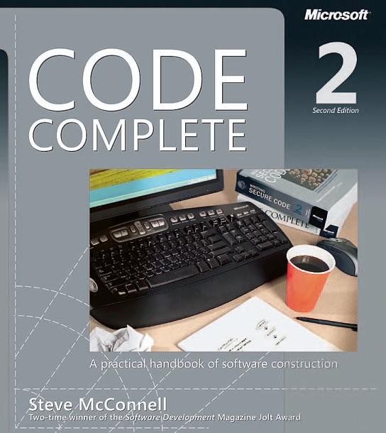

# Documenting

You can store documentation in three different places (README.md, doc.go,
GOlang comments)

|               | Description   | Visibility                                                                   |
| ------------- |---------------|------------------------------------------------------------------------------|
| README.md     | High level information about packages with images | visible while browsing repository    |
| doc.go        | Detailed information about the GO package (usually with source code snippets) | visible in godoc |
| Comments      | Function/Type documentation in GO code |                                                     |

For more information, check out the book:

