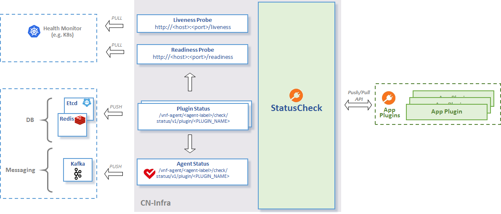

# Concept

The `statuscheck` infrastructure plugin monitors the overall status of a 
CN-Infra based app by collecting and aggregating partial statuses
of agents plugins.
The status is exposed to external clients via [ETCD - datasync](../../datasync) 
and [HTTP](../../rpc/rest), as shown in the following diagram:



For more detailed description see the godoc (especially [doc.go](doc.go)).

## Overall Agent Status

The overall Agent Status is aggregated from all Plugins' Status (logical
AND for each Plugin Status success/error).

The agent's current overall status can be retrieved from ETCD from the 
following key: `/vnf-agent/<agent-label>/check/status`

```
$ etcdctl get /vnf-agent/<agent-label>/check/status/v1/agent
/vnf-agent/<agent-label>/check/status/v1/agent
{"build_version":"e059fdfcd96565eb976a947b59ce56cfb7b1e8a0","build_date":"2017-06-16.14:59","state":1,"start_time":1497617981,"last_change":1497617981,"last_update":1497617991}
```

To verify the agent status via HTTP (e.g. for Kubernetes 
[liveness and readiness probes][1], use the `/liveness` and `/readiness`
URLs:
```
$ curl -X GET http://localhost:9191/liveness
{"build_version":"e059fdfcd96565eb976a947b59ce56cfb7b1e8a0","build_date":"2017-06-16.14:59","state":1,"start_time":1497617981,"last_change":1497617981,"last_update":1497617991}
$ curl -X GET http://localhost:9191/readiness
{"build_version":"e059fdfcd96565eb976a947b59ce56cfb7b1e8a0","build_date":"2017-06-16.14:59","state":1,"start_time":1497617981,"last_change":1497617981,"last_update":1497617991}
```

To change the HTTP server port (default `9191`), use the `http-port` 
option of the agent, e.g.:
```
$ vpp-agent -http-port 9090
```

## Plugin Status

Plugin may use `PluginStatusWriter.ReportStateChange` API to **PUSH**
the status information at any time. For optimum performance,
'statuscheck' will then propagate the status report further to external
clients only if it has changed since the last update.

Alternatively, plugin may chose to use the **PULL** based approach and
define the `probe` function passed to `PluginStatusWriter.Register` API.
`statuscheck` will then periodically probe the plugin for the current
status. Once again, the status is propagated further only if it has
changed since the last enquiry.

It is recommended not to mix the PULL and the PUSH based approach
within the same plugin.

To retrieve the current status of a plugin from ETCD, use the following
key template: `/vnf-agent/<agent-label>/check/status/v1/plugin/<PLUGIN_NAME>`
 
For example, to retrieve the status of the GoVPP plugin, use: 

```
$ etcdctl get /vnf-agent/<agent-label>/check/status/v1/plugin/GOVPP
/vnf-agent/<agent-label>/check/status/v1/plugin/GOVPP
{"state":2,"last_change":1496322205,"last_update":1496322361,"error":"VPP disconnected"}
```

### PUSH Plugin Status:


### PULL Plugins Status - PROBING:


[1]: https://kubernetes.io/docs/tasks/configure-pod-container/configure-liveness-readiness-probes/