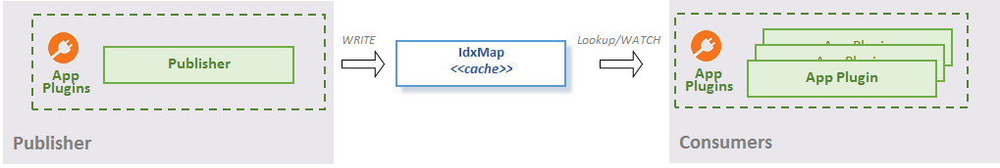

# Concept

The idxmap package provides an enhanced mapping structure to help in
the following use cases:
* Exposing read-only access to plugin local data for other plugins
* Secondary indexing
* Data caching for key-value store (such as etcd)

For more detailed description see the godoc.

## Exposing plugin local information Use Case
App plugins often need to expose some structured information to other
plugins inside the agent (see the following diagram).

Structured data stored in idxmap are available for (possibly concurrent)
read access to other plugins:
1. either via lookup using primary keys or secondary indices;
2. or via watching for data changes in the map using channels
   or callbacks (subscribe for changes and receive notification once
   an item is added, changed or removed).

TODO: remove "\<\<cache\>\>" string from the image

## Caching Use Case
It is useful to have the data from a key-value store cached when
you need to:
- minimize the number of lookups into the key-value store
- execute lookups by secondary indexes for key-value stores that
  do not necessarily support secondary indexing (e.g. etcd)

[CacheHelper](mem/cache_helper.go) turns `idxmap` (injected as field
`IDX`) into an indexed local copy of remotely stored key-value data.
`CacheHelper` watches the target key-value store for data changes
and resync events. Received key-value pairs are transformed into
the name-value (+ secondary indices if defined) pairs and stored into
the injected idxmap instance.
For a visual explanation, see the diagram below:

Packages that [use index map](https://godoc.org/github.com/ligato/cn-infra/idxmap?importers).
The constructor that combines `CacheHelper` with `idxmap` to build the cache from the example 
can be found there as well.

## Examples
* Isolated and simplified examples can be found here: 
  * [lookup](https://github.com/ligato/vpp-agent/tree/master/examples/idx_mapping_lookup)
  * [watch](https://github.com/ligato/vpp-agent/tree/master/examples/idx_mapping_watcher)

