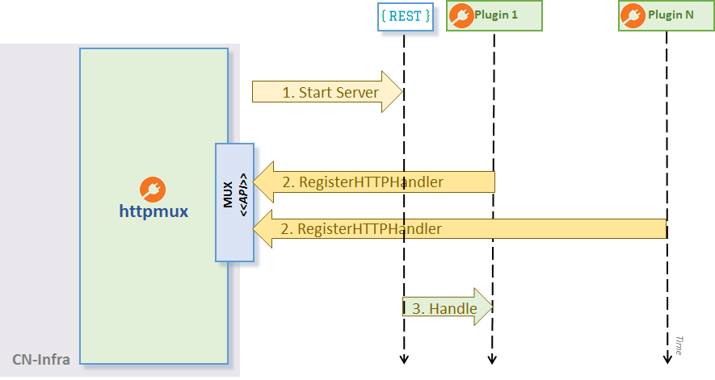

# HTTPmux

The `REST Plugin` is a infrastructure Plugin which allows app plugins 
to handle HTTP requests (see the diagram below) in this sequence:
1. httpmux starts the HTTP server in its own goroutine
2. Plugins register their handlers with `REST Plugin`.
   To service HTTP requests, a plugin must first implement a handler
   function and register it at a given URL path using
   the `RegisterHTTPHandler` method. `REST Plugin` uses an HTTP request
   multiplexer from the `gorilla/mux` package to register
   the HTTP handlers by the specified URL path.
3. HTTP server routes HTTP requests to their respective registered handlers
   using the `gorilla/mux` multiplexer.



**Configuration**

- the server's port can be defined using commandline flag `http-port` or 
  via the environment variable HTTP_PORT.

**Example**

The following example demonstrates the usage of the `REST Plugin` plugin
API:
```
// httpExampleHandler returns a very simple HTTP request handler.
func httpExampleHandler(formatter *render.Render) http.HandlerFunc {

    // An example HTTP request handler which prints out attributes of 
    // a trivial Go structure in JSON format.
    return func(w http.ResponseWriter, req *http.Request) {
        formatter.JSON(w, http.StatusOK, struct{ Example string }{"This is an example"})
    }
}

// Register our HTTP request handler as a GET method serving at 
// the URL path "/example".
httpmux.RegisterHTTPHandler("/example", httpExampleHandler, "GET")
```

Once the handler is registered with `REST Plugin` and the agent is running, 
you can use `curl` to verify that it is operating properly:
```
$ curl -X GET http://localhost:9191/example
{
  "Example": "This is an example"
}
```


## Security

REST plugin allows to optionally configure following security features:
- server certificate (HTTPS)
- Basic HTTP Authentication - username & password
- client certificates
- token based authorization

All of them are disabled by default and can be enabled by config file:

```yaml
endpoint: 127.0.0.1:9292
server-cert-file: server.crt
server-key-file: server.key
client-cert-files:
  - "ca.crt"
client-basic-auth:
  - "user:pass"
  - "foo:bar"
```

If `server-cert-file` and `server-key-file` are defined the server requires HTTPS instead
of HTTP for all its endpoints.

`client-cert-files` the list of the root certificate authorities that server uses to validate
client certificates. If the list is not empty only client who provide a valid certificate
is allowed to access the server.

`client-basic-auth` allows to define user password pairs that are allowed to access the
server. The config option defines a static list of allowed user. If the list is not empty default
staticAuthenticator is instantiated. Alternatively, you can implement custom authenticator and inject it
into the plugin (e.g.: if you want to read credentials from ETCD).


***Example***

In order to generated self-signed certificates you can use the following commands:

```bash
#generate key for "Our Certificate Authority"
openssl genrsa -out ca.key 2048

#generate certificate for CA
openssl req -new -nodes -x509 -key ca.key -out ca.crt  -subj '/CN=CA'

#generate certificate for the server assume that server will be accessed by 127.0.0.1
openssl genrsa -out server.key 2048
openssl req -new -key server.key -out server.csr -subj '/CN=127.0.0.1'
openssl x509 -req -extensions client_server_ssl -extfile openssl_ext.conf -in server.csr -CA ca.crt -CAkey ca.key -CAcreateserial -out server.crt

#generate client certificate
openssl genrsa -out client.key 2048
openssl req -new -key client.key -out client.csr -subj '/CN=client'
openssl x509 -req -in client.csr -CA ca.crt -CAkey ca.key -CAcreateserial -out client.crt -days 360

```

Once the security features are enabled, the endpoint can be accessed by the following commands:

- **HTTPS**
where `ca.pem` is a certificate authority where server certificate should be validated (in case of self-signed certificates)
  ```
  curl --cacert ca.crt  https://127.0.0.1:9292/log/list
  ```

- **HTTPS + client cert** where `client.crt` is a valid client certificate.
  ```
  curl --cacert ca.crt  --cert client.crt --key client.key  https://127.0.0.1:9292/log/list
  ```

- **HTTPS + basic auth** where `user:pass` is a valid username password pair.
  ```
  curl --cacert ca.crt  -u user:pass  https://127.0.0.1:9292/log/list
  ```

- **HTTPS + client cert + basic auth**
  ```
  curl --cacert ca.crt  --cert client.crt --key client.key -u user:pass  https://127.0.0.1:9292/log/list
  ```
  
### Token-based authorization

REST plugin supports authorization based on tokens. To enable the feature, use `http.conf` file:

```
enable-token-auth: true
```

Authorization restricts access to every registered permission group URLs. The user receives token
after login, which grants him access to all permitted sites. The token is valid until the user is logged in, or until it expires.

The expiration time is a token claim, set in the config file:

```
token-expiration: 600000000000  
```

Note that time is in nanoseconds. If no time is provided, the default value of 1 hour is set.

Token uses by default pre-defined signature string as the key to sign it. This can be also 
changed via config file:

```
token-signature: <string>
```

After login, the token is required in authentication header in the format `Bearer <token>`, so it
can be validated. If REST interface is accessed via a browser, the token is written to cookie file.

#### Users and permission groups

Users have to be pre-defined in `http.conf` file. User definition consists of name, hashed
password and permission groups.

**Name** defines username (login). Name "admin" is forbidden since the admin user is 
created automatically with full permissions and password "ligato123"

**Password** has to be hashed. It is possible to use 
[password-hasher](security/password-hasher/README.md) to help with it. Password also has 
to be hashed with the same cost value, as defined in the configuration file:

```
password-hash-cost: <number>
```

Minimal hash cost is 4, maximal value is 31. The higher the cost, the more CPU time 
memory is required to hash the password.

**Permission Groups** define a list of permissions; allowed URLs and methods. Every user needs at least one permission group defined, otherwise it will not have access to anything. Permission group is described in 
[proto model](security/model/access-security/accesssecurity.proto). 

To add permission group, use rest plugin API:

```
RegisterPermissionGroup(group ...*access.PermissionGroup)
```

Every permission group has a name and a list o permissions. Permission defines URL and
a list of methods which may be performed. 

To add permission group to the user, put its name to the config file under user's field 
`permissions`. 

#### Login and logout

To log in a user, follow the URL `http://localhost:9191/login`. The site is enabled for two
methods. It is possible to use a `POST` to directly provide credentials in the format:

```
{
	"username": "<name>",
	"password": "<pass>"
}
```

The site returns access token as plain text. If URL is accessed with `GET`, it shows the login page where the credentials are supposed to be put. After successful submit, 
it redirects to the index.

To log out, post username to `http://localhost:9191/logout`.

```
{
	"username": "<name>"
}
```
 