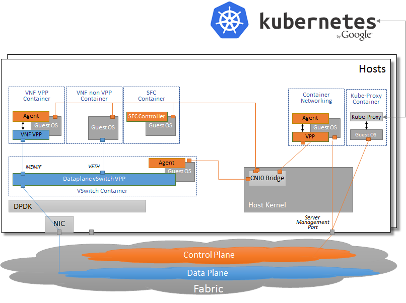
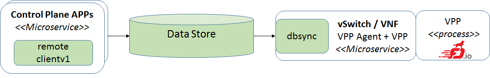
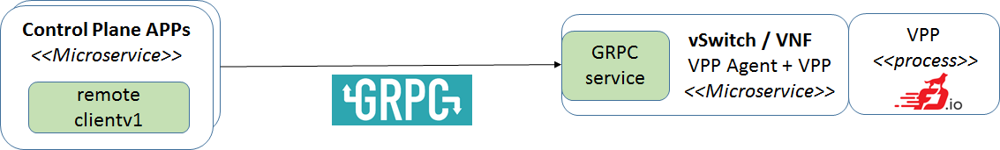
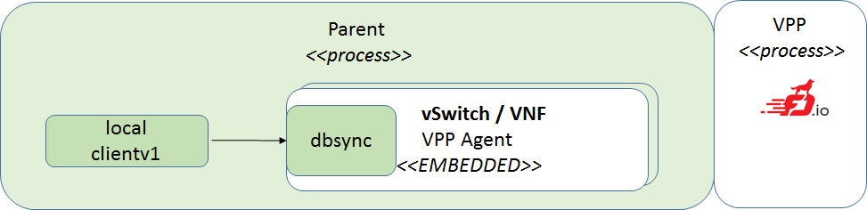

# Deployment

VPP Agent can run on any server where VPP is installed. It can run
on a bare metal, in a VM, or in a container.
 
Benefits of putting a VPP-based VNF (basically just a combination of VPP
and the VPP Agent) into a container are:
 * simplified upgrades and startup/shutdown, which results in improved
   scalability
 * Container-based VNFs are in essence lightweight and reusable
   data-plane microservices which can be used to build larger systems
   and applications
 * supports container healing 
 
## K8s integration
The following diagram shows VPP deployement in:
- Data Plane vSwitch
- Control Plane vSwitch (TBD [Contiv](http://contiv.github.io/) integration)
- VPP VNF Container
- Non-VPP Container

K8s:
- starts/stops the containers running on multiple hosts
- checks health of the individual containers (using probes - HTTP calls)

## NB (North-bound) configuration vs. deployment
VPP + Agent can be deployed in different environments. Several deployment 
alternatives are briefly described in the following sub-chapters.
Regardless of the deployment, the VPP Agent can be configured using
the same Client v1 interface. There are three different implementations
of the interface:
 - local client
 - remote client using Data Broker
 - remote client using GRPC

### Key Value Data Store for NB (north-bound)
The Control Plane using remote client writes (north-bound) configuration
to the Data Store (tested with ETCD, Redis). VPP Agent watches dedicated
key prefixes in Data Store using dbsync package.

TBD links to the code

### GRPC for NB (north-bound)
The Control Plane using remote client sends configuration (north-bound)
via Remote Procedure Call (in this case GRPC). VPP Agent exposes GRPC
service.

### Embedded deployment
VPP Agent can be directly embedded into a different project.
For integration with [Contiv](http://contiv.github.io/) we decided to
embed the VPP Agent directly into the netplugin process as a new driver
for VPP-based networking. Using the Local client v1 the driver is able
to propagate the configuration into the Agent via Go channels.

TBD links to the code