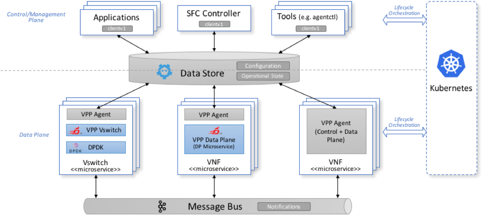

# Architecture

Brief description:
* **SFC Controller** - renders a logical network topology (which defines
  how VNF are logically interconnected) onto a given physical network
  and VNF placement; the rendering process creates configuration for VNFs
  and network devices.
  
* **Control Plane Apps** - renders specific VPP configuration for multiple 
  agents to the Data Store

* **Clientv1** - VPP Agent clients (control plane apps & tools)
  can use the clientv1 library to interact with one or more VPP Agents.
  The clientv1 library is based on generated GO structures from protobuf
  messages. The library contains helper methods for working with KV Data
  Stores, used for generation of keys and storage/retrieval
  of configuration data to/from Data Store under a given key.

* **Data Store** (ETCD, Redis, etc.) is used to:
  * store VPP configuration; this data is put into the Data Store by one
    or more orchestrator apps and retrieved by one or more VPP Agents.
  * store operational state, such as network counters /statistics
    or errors; this data is put into the Data Store by one or more VPP
    Agents and retrieved by one or more monitoring/analytics applications.

* **VPP vSwitch** - privileged container that cross-connects multiple VNFs

* **VPP VNF** - a container with a Virtual Network Function implementation 
  based on VPP

* **Non VPP VNF** - container with a non-VPP based Virtual Network Function;
  that can nevertheless interact with VPP containers (see below MEMIFs,
  VETH)

* **Messaging** - AD-HOC events (e.g. link UP/Down)

# Requirements
The VPP Agent was designed to meet the following requirements:
* Modular design with API contracts
* Cloud native
* Fault tolerant
* Rapid deployment
* High performance & minimal footprint

## Modular design with API contract
The VPP Agent codebase is basically a collection of plugins.
Each plugin provides a specific service defined by the service's API.
VPP Agent's functionality can be easily extended by introducing new
plugins. Well-defined API contracts facilitate seamless integration
of new plugins into the VPP Agent or integration of multiple plugins
into a new application.

## Cloud native
*Assumption*: both data plane and control plane can be implemented as
a set of microservices independent of each other. Therefore, the overall
configuration of a system may be incomplete at times, since one object
may refer to another object owned by a service that has not been
instantiated yet. The VPP agent can handle this case - at first it skips
the incomplete parts of the overall configuration, and later, when
the configuration is updated, it tries again to configure what has been
previously skipped.

The VPP Agent is usually deployed in a container together with VPP. There
can be many of these containers in a given cloud or in a more complex data 
plane implementation. Containers can be used in many different 
infrastructures (on-premise, hybrid, or public cloud). The VPP + VPP Agent 
containers have been tested with [Kubernetes](https://kubernetes.io/).

Control Plane microservices do not really depend on the current lifecycle
phase of the VPP Agents. Control Plane can render config data for one or 
more VPP Agents and store it in the KV Data Store even if (some of) the 
VPP Agents have not been started yet. This is possible because:
- The Control Plane does not access the VPP Agents directly, instead it
  accesses the KV Data Store; the VPP Agents are responsible
  for downloading their data from the Data Store.
- Data structures in configuration files use logical object names, not 
  internal identifiers of the VPP). See the 
  [protobuf](https://developers.google.com/protocol-buffers/) 
  definitions in the `model` sub folders in various VPP Agent plugins. 

## Fault tolerance
Each microservice has its own lifecycle, therefore the VPP Agent is 
designed to recover from HA events even when some subset of microservices 
(e.g. db, message bus...) are temporary unavailable.

The same principle can be applied also for the VPP Agent process and the
VPP process inside one container. The VPP Agent checks the VPP actual 
configuration and does data synchronization by polling latest
configuration from the KV Data Store.

VPP Agent also reports status of the VPP in probes & Status Check Plugin.  

In general, VPP Agents:
 * propagate errors to upper layers & report to the Status Check Plugin
 * fault recovery is performed with two different strategies:
   * easily recoverable errors: retry data synchronization (Data Store 
     configuration -> VPP Binary API calls)
   * otherwise: report error to control plane which can failover or 
     recreate the microservice

## Rapid deployment

Containers allow to reduce deployment time to seconds. This is due to the 
fact that containers are created at process level and there is no need to
boot an OS. Moreover, K8s helps with the (un)deployment of possibly
different versions of multiple microservice instances.

## High performance & minimal footprint
Performance optimization is currently a work-in-progress.
Several bottlenecks that can be optimized have been identified:
- GOVPP
- minimize context switching
- replace blocking calls to non-blocking (asynchronous) calls