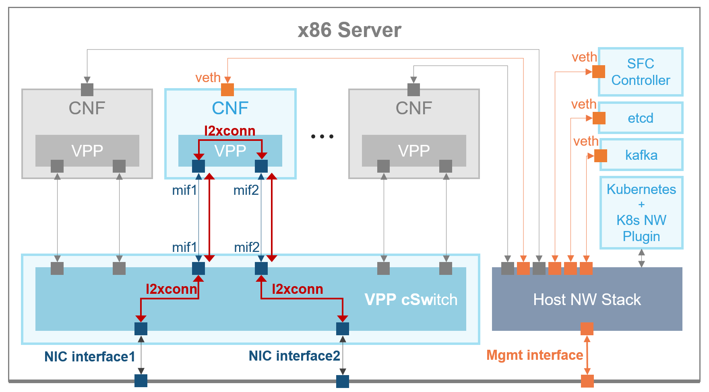
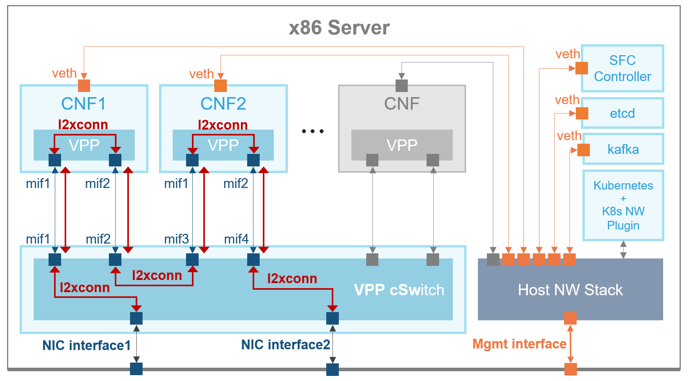

## Perfomance Demo Scenarios
### Scenario 1 - 1 x VNF via memifs



### Scenario 2 - 2 x VNF via memifs


### Scenario 4 - 1 x VNF via veths+af_packet


## Prepare Phase
Install and run Kubernetes, e.g. using [kubeadm](https://kubernetes.io/docs/setup/independent/create-cluster-kubeadm/).

Deploy ETCD and Kafka server PODs:
```
$ kubectl apply -f etcd.yaml
$ kubectl apply -f kafka.yaml
```

Verify the ETCD and Kafka PODs are ready:
```
$ kubectl get pods
NAME            READY     STATUS    RESTARTS   AGE
etcd-server   1/1       Running   0          12s
kafka-server    1/1       Running   0          5s
```


Modify ETCD configuration files, which contain physical interface names
`FortyGigabitEthernet89/0/0` and `FortyGigabitEthernet89/0/1`. If this does
not match your setup, set the names as follows:
```
./interfaces.sh GigabitEthernet0/0/1 GigabitEthernet0/0/2
```

Also modify VPP startup config files for each scenario, to match your HW, e.g.
[scenario1/vswitch/vswitch-vpp-cfg.yaml](scenario1/vswitch/vswitch-vpp-cfg.yaml).
PIC addresses of the NICs should match interface names, e.g. ` 0000:89:00.0`
corresponds to `FortyGigabitEthernet89/0/0`.

If the two above steps are not configured properly, the demo will still work,
but the vSwitch will lack the physical interfaces.


## Deploy Network Service
Import ETCD configuration for the given scenario (1, 2 or 4):
```
$ sudo ./etcdimport.sh scenario1/etcd.txt
```

Deploy vSwitch + VNF PODs of the given scenario (1, 2 or 4):
```
$ kubectl apply -R -f scenario1
```

Verify the PODs are ready:
```
$ kubectl get pods
NAME             READY     STATUS    RESTARTS   AGE
etcd-server    1/1       Running   0          33m
kafka-server     1/1       Running   0          6h
vnf-vpp          1/1       Running   0          26s
vswitch-vpp      1/1       Running   0          26s
```

## Verify Service is Up

Telnet to the vSwitch VPP:
```
$ telnet localhost 5002
vpp# show interface
vpp# quit
```

Telnet to the VNF VPP:
```
$ kubectl describe pod vnf-vpp | grep IP
IP:		192.168.65.193
$ telnet 192.168.65.193 5002
vpp# show interface
vpp# quit
```
(use `vnf1-vpp` / `vnf2-vpp` instead of `vnf-vpp` for the scenario 2)


## Cleanup
Undeploy the scenario:
```
$ kubectl delete -R -f scenario1/
```

Wipe ETCD (restart it):
```
$ kubectl delete -f etcd.yaml
$ kubectl apply -f etcd.yaml
```
(make sure the POD gets undeployed after `delete` before `apply` by executing `kubectl get pods`)

You can continue with deploying of the next scenario as described in [Deploy Network Service](#Deploy Network Service).
