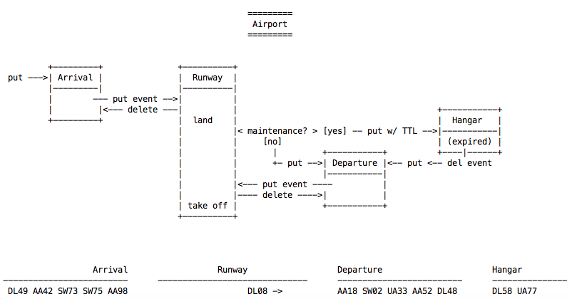

# Examples for cn-infra/db/keyval/redis

* [Get Started](#get-started)
* [Simple Example](#simple-example)
* [Airport Example](#airport-example)
* [Known Issues](#known-issues)

## Get Started

To run these examples, you must have access to a Redis installation,
either locally or remotely.

You can download docker images from:
* [https://github.com/AliyunContainerService/redis-cluster](https://github.com/AliyunContainerService/redis-cluster)
  (Redis cluster with Sentinel)
* [https://github.com/Grokzen/docker-redis-cluster](https://github.com/Grokzen/docker-redis-cluster)
  (Redis standalone and cluster)

Modify API configuration to match your environment.
See sample configurations to use with the API here:
* [node-client.yaml](node-client.yaml)
* [sentinel-client.yaml](sentinel-client.yaml)
* [cluster-client.yaml](cluster-client.yaml)

## Simple Example
  * Straight API calls, no particular scenario
  * Also, look at the function generateSampleConfigs() which shows
    how to generate and save each type of client configurations.

To start the example, 'cd' to cn-infra/db/keyval/redis/examples
directory. Run
```
go run simple/simple.go -redis-config=<redis client config yaml>
```

## Airport Example
  * Simulates airport operations with four functional modules - arrival,
    departure, runway and hangar
  * Communicates and updates flight info through Redis.
  * Displays flight status, live.
  ___
  
  ___

To start the example, 'cd' to cn-infra/db/keyval/redis/examples
directory. Run
```
go run airport/airport.go -redis-config=<redis client config yaml>
```

## Known Issues
* When working with Redis Cluster:

    Redis Multi-key commands, like MGET, KEYS, SCAN, PUBSCRIBE...etc.
    do not work unless all keys involved belong to the same hash slot.
    This API uses all of these commmands.  If you have to use Redis
    Cluster, you can force all keys to be stored in the same hash slot
    by using ["hash tag"](https://redis.io/topics/cluster-spec#keys-hash-tags).
