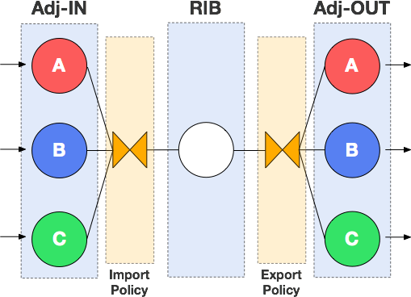
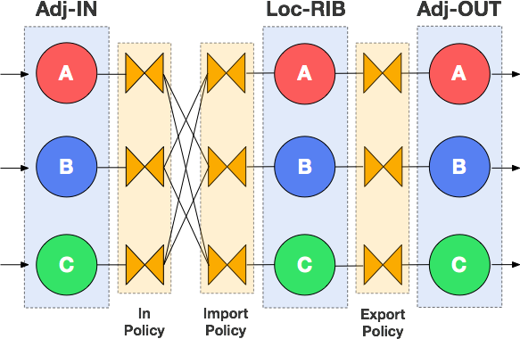
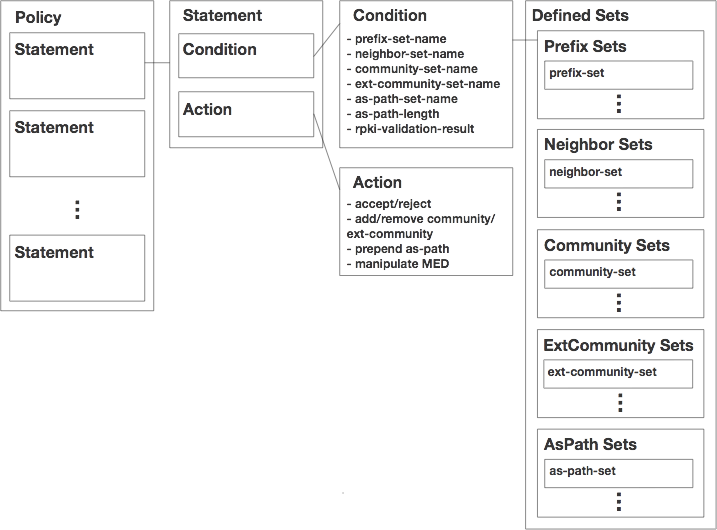

# Policy configuration

This page explains GoBGP policy feature for controlling the route
advertisement. It might be called Route Map in other BGP
implementations.

We explain the overview firstly, then the details, 

## Prerequisites

Assumed that you finished [Getting Started](https://github.com/osrg/gobgp/blob/master/docs/sources/getting-started.md).

## Contents
- [Overview](#overview)
- [Policy Model](#model)
- [Route Server Policy Model](#rs-model)
- [Policy Structure](#policy)
- [Policy Configuration](#configuration)
    - [Defining defined-sets](#defined-sets)
    - [Defining bgp-defined-sets](#bgp-defined-sets)
    - [Defining policy-definitions](#policy-definition)
    - [Attaching policy](#attachment)
        - [Attach policy to global rib](#global-attachment)
        - [Attach policy to route-server-client](#rs-attachment)

## <a name="overview"> Overview

Policy is a way to control how BGP routes inserted to RIB or advertised to
peers. Policy has two parts, **Condition** and **Action**. 
When a policy is configured, **Action** is applied to routes which meet **Condition**
before routes proceed to next step.

GoBGP supports **Condition** like `prefix`, `neighbor`(source/destination of the route),
`aspath` etc.., and **Action** like `accept`, `reject`, `MED/aspath/community manipulation`
etc...

You can configure policy by configuration file, CLI or gRPC API.
Here, we show how to configure policy via configuration file.

## <a name="model"> Policy Model

The following figure shows how policy works in normal BGP configuration.

<p align="center">
    
</p>

There are **Import** and **Export** policy. **Import** policy is invoked
before best path calculation and pushing routes to RIB.
**Export** policy is invoked after that.

You can check each policy by the following commands.

```shell
$ gobgp global policy import
$ gobgp global policy export
```

## <a name="rs-model"> Route Server Policy Model

The following figure shows how policy works in [route server BGP configuration](https://github.com/osrg/gobgp/blob/master/docs/sources/route-server.md).

<p align="center">
    
</p>

In route server mode, adding to **Import** and **Export**, we have **In** policy.

**Import** and **Export** policies are defined with respect to the
local routing table. The **Import** policy defines what routes will be
imported into its local RIBs. The **Export** policy defines what
routes will be exported from its local RIBs. **In** polices are
defined with respect to a peer. The **In** policy defines what routes will go
to other peers' local routing tables.

You can check each policy by the following commands.

```shell
$ gobgp neighbor <neighbor-addr> policy in
$ gobgp neighbor <neighbor-addr> policy import
$ gobgp neighbor <neighbor-addr> policy export
```

## <a name="policy"> Policy Stracture

<p align="center">
    
</p>

A policy consists of statements. Each statement has condition(s) and action(s).

Conditions are categorized into attributes below:

- prefix
- neighbor
- aspath
- aspath length
- community
- extended community
- rpki validation result
- route type (internal/external/local)
- large community

As showed in the figure above, some of the conditions point to defined sets,
which are a container for each condition item (e.g. prefixes).

Actions are categorized into attributes below:

- accept or reject
- add/replace/remove community or remove all communities
- add/subtract or replace MED value
- set next-hop
- set local-pref
- prepend AS number in the AS_PATH attribute

When **ALL** conditions in the statement are `true`, the action(s) in the statement are executed.

You can check policy configuration by the following commands.

```shell
$ gobgp policy
$ gobgp policy statement
$ gobgp policy prefix
$ gobgp policy neighbor
$ gobgp policy as-path
$ gobgp policy community
$ gobgp policy ext-community
$ gobgp policy large-community
```

## <a name="configuration"> Policy Configuration

Policy Configuration comes from two parts, [definition](#defined-sets) and [attachment](#attachment).
For definition, we have [defined-sets](#defined-sets) and [policy-definition](#policy-definition).
**defined-sets** defines condition item for some of the condition type.
**policy-definitions** defines policies based on actions and conditions.

- **defined-sets**
    A single **defined-sets** entry has prefix match that is named **prefix-sets** and neighbor match part that is named **neighbor-sets**. It also has **bgp-defined-sets**, a subset of **defined-sets** that defines conditions referring to BGP attributes such as aspath. This **defined-sets** has a name and it's used to refer to **defined-sets** items from outside.

- **policy-definitions**
    **policy-definitions** is a list of policy. A single element has **statements** part that combines conditions with an action.

Below are the steps for policy configuration

1. define defined-sets
  1. define prefix-sets
  1. define neighbor-sets
1.  define bgp-defined-sets
  1. define community-sets
  1. define ext-community-sets
  1. define as-path-setList
  1. define large-community-sets
1. define policy-definitions 
1. attach policies to global rib (or neighbor local rib when neighbor is [route-server-client](https://github.com/osrg/gobgp/blob/master/docs/sources/route-server.md)).


### <a name="defined-sets"> 1. Defining defined-sets
defined-sets has prefix information and neighbor information in prefix-sets and neighbor-sets section, and GoBGP uses these information to evaluate routes.
Defining defined-sets is needed at first.
prefix-sets and neighbor-sets section are prefix match part and neighbor match part.

- defined-sets example

 ```toml
# prefix match part
[[defined-sets.prefix-sets]]
  prefix-set-name = "ps1"
  [[defined-sets.prefix-sets.prefix-list]]
    ip-prefix = "10.33.0.0/16"
    masklength-range = "21..24"

# neighbor match part
[[defined-sets.neighbor-sets]]
  neighbor-set-name = "ns1"
  neighbor-info-list = ["10.0.255.1"]
 ```

  ----

 #### prefix-sets
 prefix-sets has prefix-set-list, and prefix-set-list has prefix-set-name and prefix-list as its element. prefix-set-list is used as a condition. Note that prefix-sets has either v4 or v6 addresses.

 **prefix-set-list** has 1 element and list of subelement.

 | Element          | Description                        | Example       | Optional   |
 |------------------|------------------------------------|---------------|------------|
 | prefix-set-name  | name of prefix-set                 | "ps1"         |            |
 | prefix-list      | list of prefix and range of length |               |            |

 **PrefixLlist** has 2 elements.

 | Element          | Description       | Example        | Optional   |
 |------------------|-------------------|----------------|------------|
 | ip-prefix        | prefix value      | "10.33.0.0/16" |            |
 | masklength-range | range of length   | "21..24"       | Yes        |


 ##### Examples
 - example 1
    - Match routes whose high order 2 octets of NLRI is 10.33 and its prefix length is between from 21 to 24
    - If you define a prefix-list that doesn't have MasklengthRange, it matches routes that have just 10.33.0.0/16 as NLRI.

  ```toml
  # example 1
  [[defined-sets.prefix-sets]]
    prefix-set-name = "ps1"
    [[defined-sets.prefix-sets.prefix-list]]
      ip-prefix = "10.33.0.0/16"
      masklength-range = "21..24"
  ```


 - example 2
    - If you want to evaluate multiple routes with a single prefix-set-list, you can do this by adding an another prefix-list like this:
    - This prefix-set-list match checks if a route has 10.33.0.0/21 to 24 or 10.50.0.0/21 to 24.

  ```toml
  # example 2
  [[defined-sets.prefix-sets]]
    prefix-set-name = "ps1"
    [[defined-sets.prefix-sets.prefix-list]]
      ip-prefix = "10.33.0.0/16"
      masklength-range = "21..24"
    [[defined-sets.prefix-sets.prefix-list]]
      ip-prefix = "10.50.0.0/16"
      masklength-range = "21..24"
  ```

 - example 3
    - prefix-set-name under prefix-set-list is reference to a single prefix-set.
    - If you want to add different prefix-set more, you can add other blocks that form the same structure with example 1.

  ```toml
  # example 3
  [[defined-sets.prefix-sets]]
    prefix-set-name = "ps1"
    [[defined-sets.prefix-sets.prefix-list]]
      ip-prefix = "10.33.0.0/16"
      masklength-range = "21..24"
  [[defined-sets.prefix-sets]]
    prefix-set-name = "ps2"
    [[defined-sets.prefix-sets.prefix-list]]
      ip-prefix = "10.50.0.0/16"
      masklength-range = "21..24"
  ```

  ----

 #### neighbor-sets

 neighbor-sets has neighbor-set-list, and neighbor-set-list has neighbor-set-name and neighbor-info-list as its element. It is necessary to specify a neighbor address in neighbor-info-list. neighbor-set-list is used as a condition.

 **neighbor-set-list** has 1 element and list of subelement.

 | Element            |Description                | Example      | Optional   |
 |--------------------|---------------------------|--------------|------------|
 | neighbor-set-name  | name of neighbor-set      | "ns1"        |            |
 | neighbor-info-list | list of neighbor address  |              |            |

 **neighbor-info-list** has 1 element.

 | Element         |Description          | Example      | Optional   |
 |-----------------|---------------------|--------------|------------|
 | address         | neighbor address    | "10.0.255.1" |            |

 ##### Examples

 - example 1
  ```toml
  # example 1
  [[defined-sets.neighbor-sets]]
    neighbor-set-name = "ns1"
    neighbor-info-list = ["10.0.255.1"]
  ```

 - example 2
    - As with prefix-set-list, neighbor-set-list can have multiple neighbor-info-list like this.

  ```toml
  # example 2
  [[defined-sets.neighbor-sets]]
    neighbor-set-name = "ns1"
    neighbor-info-list = ["10.0.255.1", "10.0.255.2"]
  ```

 - example 3
    - As with prefix-set-list, multiple neighbor-set-lists can be defined. 
 
  ```toml
  # example 3
  [[defined-sets.neighbor-sets]]
    neighbor-set-name = "ns1"
    neighbor-info-list = ["10.0.255.1"]
  # another neighbor-set-list
  [[defined-sets.neighbor-sets]]
    neighbor-set-name = "ns2"
    neighbor-info-list = ["10.0.254.1"]
  ```

---

### <a name="bgp-defined-sets"> 2. Defining bgp-defined-sets

bgp-defined-sets has Community information, Extended Community
information and AS_PATH information in each Sets section
respectively. And it is a child element of defined-sets.
community-sets, ext-community-sets and as-path-sets section are each match
part. Like prefix-sets and neighbor-sets, each can have multiple sets and each set can have multiple values.

- bgp-defined-sets example

 ```toml
 # Community match part
 [[defined-sets.bgp-defined-sets.community-sets]]
   community-set-name = "community1"
   community-list = ["65100:10"]
 # Extended Community match part
 [[defined-sets.bgp-defined-sets.ext-community-sets]]
   ext-community-set-name = "ecommunity1"
   ext-community-list = ["RT:65100:10"]
 # AS_PATH match part
 [[defined-sets.bgp-defined-sets.as-path-sets]]
   as-path-set-name = "aspath1"
   as-path-list = ["^65100"]
# Large Community match part
 [[defined-sets.bgp-defined-sets.large-community-sets]]
   large-community-set-name = "lcommunity1"
   large-community-list = ["65100:100:100"]
 ```

  ----

 #### community-sets
 community-sets has community-set-name and community-list as its element. The Community value are used to evaluate communities held by the destination.

 | Element            | Description             | Example      | Optional |
 |--------------------|-------------------------|--------------|----------|
 | community-set-name | name of CommunitySet    | "community1" |          |
 | community-list     | list of community value |              |          |

 **community-list** has 1 element.

 | Element    | Description             | Example      | Optional |
 |------------|-------------------------|--------------|----------|
 | community  | community value         | "65100:10"   |          |

 You can use regular expressions to specify community in community-list.

 ##### Examples
 - example 1
   - Match routes which has "65100:10" as a community value.

  ```toml
  # example 1
  [[defined-sets.bgp-defined-sets.community-sets]]
    community-set-name = "community1"
    community-list = ["65100:10"]
  ```

 - example 2
    - Specifying community by regular expression
    - You can use regular expressions based on POSIX 1003.2 regular expressions.

  ```toml
  # example 2
  [[defined-sets.bgp-defined-sets.community-sets]]
    community-set-name = "community2"
    community-list = ["6[0-9]+:[0-9]+"]
  ```
   ----

 #### ext-community-sets
 ext-community-sets has ext-community-set-name and ext-community-list as its element. The values are used to evaluate extended communities held by the destination.

 | Element                | Description                        | Example          | Optional |
 |------------------------|------------------------------------|------------------|----------|
 | ext-community-set-name | name of ExtCommunitySet            | "ecommunity1"    |          |
 | ext-community-list     | list of extended community value   |　　　             |          |

 **ext-community-list** has 1 element.

 | Element        | Description                | Example          | Optional |
 |----------------|----------------------------|------------------|----------|
 | ext-community  | extended community value   | "RT:65001:200"   |          |

 You can use regular expressions to specify extended community in ext-community-list.
 However, the first one element separated by (part of "RT") does not support to the regular expression.
 The part of "RT" indicates a subtype of extended community and subtypes that can be used are as follows:

  - RT: mean the route target.
  - SoO: mean the site of origin(route origin).

 ##### Examples
 - example 1
      - Match routes which has "RT:65001:200" as a extended community value.

  ```toml
  # example 1
  [[defined-sets.bgp-defined-sets.ext-community-sets]]
    ext-community-set-name = "ecommunity1"
    ext-community-list = ["RT:65100:200"]
  ```

 - example 2
    - Specifying extended community by regular expression
    - You can use regular expressions that is available in Golang.

  ```toml
  # example 2
  [[defined-sets.bgp-defined-sets.ext-community-sets]]
    ext-community-set-name = "ecommunity2"
    ext-community-list = ["RT:6[0-9]+:[0-9]+"]
  ```

   ----

 #### as-path-sets
 as-path-sets has as-path-set-name and as-path-list as its element. The numbers are used to evaluate AS numbers in the destination's AS_PATH attribute.

 | Element          | Description               | Example    | Optional |
 |------------------|---------------------------|------------|----------|
 | as-path-set-name | name of as-path-set       | "aspath1"  |          |
 | as-path-list     | list of as path value     |            |          |

 **as-path-list** has 1 elements.

 | Element          | Description       | Example    | Optional |
 |------------------|-------------------|------------|----------|
 | as-path-set        | as path value     | "^65100"   |          |

 The AS path regular expression is compatible with [Quagga](http://www.nongnu.org/quagga/docs/docs-multi/AS-Path-Regular-Expression.html) and Cisco.
 Note Character `_` has special meaning. It is abbreviation for `(^|[,{}() ]|$)`.

 Some examples follow:
    - From: `^65100_` means the route is passed from AS 65100 directly.
    - Any: `_65100_` means the route comes through AS 65100.
    - Origin: `_65100$` means the route is originated by AS 65100.
    - Only: `^65100$` means the route is originated by AS 65100 and comes from it directly.
    - `^65100_65001`
    - `65100_[0-9]+_.*$`
    - `^6[0-9]_5.*_65.?00$`

  ##### Examples
  - example 1
      - Match routes which come from AS 65100.

  ```toml
  # example 1
  [[defined-sets.bgp-defined-sets.as-path-sets]]
    as-path-set-name = "aspath1"
    as-path-list = ["^65100_"]
  ```

  - example 2
      - Match routes which come Origin AS 65100 and use regular expressions to other AS.

  ```toml
  # example 2
  [[defined-sets.bgp-defined-sets.as-path-sets]]
    as-path-set-name = "aspath1"
    as-path-list = ["[0-9]+_65[0-9]+_65100$"]
  ```

---

### <a name="policy-definition"> 3. Defining policy-definitions

policy-definitions consists of condition and action. Condition part is used to evaluate routes from neighbors, if matched, action will be applied.

- an example of policy-definitions

```toml
  [[policy-definitions]]
    name = "example-policy"
    [[policy-definitions.statements]]
      name = "statement1"
      [policy-definitions.statements.conditions.match-prefix-set]
        prefix-set = "ps1"
        match-set-options = "any"
      [policy-definitions.statements.conditions.match-neighbor-set]
        neighbor-set = "ns1"
        match-set-options = "invert"
      [policy-definitions.statements.conditions.bgp-conditions.match-community-set]
        community-set = "community1"
        match-set-options = "any"
      [policy-definitions.statements.conditions.bgp-conditions.match-ext-community-set]
        community-set = "ecommunity1"
        match-set-options = "any"
      [policy-definitions.statements.conditions.bgp-conditions.match-as-path-set]
        as-path-set = "aspath1"
        match-set-options = "any"
      [policy-definitions.statements.conditions.bgp-conditions.as-path-length]
        operator = "eq"
        value = 2
      [policy-definitions.statements.actions]
        route-disposition = "accept-route"
      [policy-definitions.statements.actions.bgp-actions]
        set-med = "-200"
        [policy-definitions.statements.actions.bgp-actions.set-as-path-prepend]
          as = "65005"
          repeat-n = 5
        [policy-definitions.statements.actions.bgp-actions.set-community]
          options = "add"
          [policy-definitions.statements.actions.bgp-actions.set-community.set-community-method]
            communities-list = ["65100:20"]
 ```

 The elements of policy-definitions are as follows:

  - policy-definitions

 | Element | Description   | Example          |
 |---------|---------------|------------------|
 | name    | policy's name | "example-policy" |

  - policy-definitions.statements

 | Element | Description       | Example        |
 |---------|-------------------|----------------|
 | name    | statements's name | "statement1"   |

  - policy-definitions.statements.conditions.match-prefix-set

 | Element          | Description                                                               | Example |
 |------------------|---------------------------------------------------------------------------|---------|
 | prefix-set       | name for defined-sets.prefix-sets.prefix-set-list that is used in this policy | "ps1"   |
 | match-set-options  | option for the check:<br> "any" or "invert". default is "any"             | "any"   |

  - policy-definitions.statements.conditions.match-neighbor-set

 | Element           | Description                                                                   | Example |
 |-------------------|-------------------------------------------------------------------------------|---------|
 | neighbor-set      | name for defined-sets.neighbor-sets.neighbor-set-list that is used in this policy | "ns1"   |
 | match-set-options | option for the check:<br> "any" or "invert". default is "any"                 | "any"   |

  - policy-definitions.statements.conditions.bgp-conditions.match-community-set

 | Element           | Description                                                                                        | Example        |
 |-------------------|----------------------------------------------------------------------------------------------------|----------------|
 | community-set     | name for defined-sets.bgp-defined-sets.community-sets.CommunitySetList that is used in this policy | "community1"   |
 | match-set-options | option for the check:<br> "any" or "all" or "invert". default is "any"                             | "invert"       |

  - policy-definitions.statements.conditions.bgp-conditions.match-ext-community-set

 | Element           | Description                                                                           | Example       |
 |-------------------|---------------------------------------------------------------------------------------|---------------|
 | ext-community-set | name for defined-sets.bgp-defined-sets.ext-community-sets that is used in this policy | "ecommunity1" |
 | match-set-options | option for the check:<br> "any" or "all" or "invert". default is "any"                | "invert"      |

  - policy-definitions.statements.conditions.bgp-conditions.match-as-path-set

 | Element            | Description                                                                     | Example   |
 |--------------------|---------------------------------------------------------------------------------|-----------|
 | as-path-set        | name for defined-sets.bgp-defined-sets.as-path-sets that is used in this policy | "aspath1" |
 | match-set-options  | option for the check:<br> "any" or "all" or "invert". default is "any"          | "invert"  |

  - policy-definitions.statements.conditions.bgp-conditions.match-as-path-length

 | Element  | Description                                                                                        | Example |
 |----------|----------------------------------------------------------------------------------------------------|---------|
 | operator | operator to compare the length of AS number in AS_PATH attribute. <br> "eq","ge","le" can be used. <br> "eq" means that length of AS number is equal to Value element <br> "ge" means that length of AS number is equal or greater than the Value element <br> "le" means that length of AS number is equal or smaller than the Value element| "eq"    |
 | value    | value used to compare with the length of AS number in AS_PATH attribute                            | 2       |

  - policy-definitions.statements.actions

 | Element           | Description                                                                                                   | Example        |
 |-------------------|---------------------------------------------------------------------------------------------------------------|----------------|
 | route-disposition | stop following policy/statement evaluation and accept/reject the route:<br> "accept-route" or "reject-route"  | "accept-route" |

  - policy-definitions.statements.actions.bgp-actions

 | Element  | Description                                                                           | Example |
 |----------|---------------------------------------------------------------------------------------|---------|
 | set-med  | set-med used to change the med value of the route. <br> If only numbers have been specified, replace the med value of route.<br> if number and operater(+ or -) have been specified, adding or subtracting the med value of route. | "-200"    |

  - policy-definitions.statements.actions.bgp-actions.set-community

 | Element     | Description                                                                      | Example    |
 |-------------|----------------------------------------------------------------------------------|------------|
 | options     | operator to manipulate Community attribute in the route                          | "ADD"      |
 | communities | communities used to manipulate the route's community accodriong to options below | "65100:20" |

  - policy-definitions.statements.actions.bgp-actions.set-as-path-prepend

 | Element  | Description                                                                                           | Example |
 |----------|-------------------------------------------------------------------------------------------------------|---------|
 | as       | AS number to prepend. You can use "last-as" to prepend the leftmost AS number in the aspath attribute.| "65100" |
 | repeat-n | repeat count to prepend AS                                                                            |    5    |


 - Execution condition of Action

 Action statement is executed when the result of each Condition, including match-set-options is all true.
 **match-set-options** is defined how to determine the match result, in the condition with multiple evaluation set as follows:

 | Value  | Description                                                               |
 |--------|---------------------------------------------------------------------------|
 | any    | match is true if given value matches any member of the defined set        |
 | all    | match is true if given value matches all members of the defined set       |
 | invert | match is true if given value does not match any member of the defined set |


 <br>

##### Examples
 - example 1
  - This policy definition has prefix-set *ps1* and neighbor-set *ns1* as its condition and routes matches the condition is rejected.

 ```toml
 # example 1
 [[policy-definitions]]
   name = "policy1"
   [[policy-definitions.statements]]
     name = "statement1"
     [policy-definitions.statements.conditions.match-prefix-set]
       prefix-set = "ps1"
     [policy-definitions.statements.conditions.match-neighbor-set]
       neighbor-set = "ns1"
     [policy-definitions.statements.actions]
       route-disposition = "reject-route"
 ```

 - example 2
  - policy-definition has two statements

 ```toml
 # example 2
 [[policy-definitions]]
   name = "policy1"
   # first statement - (1)
   [[policy-definitions.statements]]
     name = "statement1"
     [policy-definitions.statements.conditions.match-prefix-set]
       prefix-set = "ps1"
     [policy-definitions.statements.conditions.match-neighbor-set]
       neighbor-set = "ns1"
     [policy-definitions.statements.actions]
       route-disposition = "reject-route"
   # second statement - (2)
   [[policy-definitions.statements]]
     name = "statement2"
     [policy-definitions.statements.conditions.match-prefix-set]
       prefix-set = "ps2"
     [policy-definitions.statements.conditions.match-neighbor-set]
       neighbor-set = "ns2"
     [policy-definitions.statements.actions]
       route-disposition = "reject-route"
 ```
  - if a route matches the condition inside the first statement(1), GoBGP applies its action and quits the policy evaluation.


 - example 3
  - If you want to add other policies, just add policy-definitions block following the first one like this

 ```toml
 # example 3
 # first policy
 [[policy-definitions]]
    name = "policy1"
    [[policy-definitions.statements]]
      name = "statement1"
      [policy-definitions.statements.conditions.match-prefix-set]
        prefix-set = "ps1"
      [policy-definitions.statements.conditions.match-neighbor-set]
        neighbor-set = "ns1"
      [policy-definitions.statements.actions]
        route-disposition = "reject-route"
 # second policy
 [[policy-definitions]]
    name = "policy2"
    [[policy-definitions.statements]]
      name = "statement2"
      [policy-definitions.statements.conditions.match-prefix-set]
        prefix-set = "ps2"
      [policy-definitions.statements.conditions.match-neighbor-set]
        neighbor-set = "ns2"
      [policy-definitions.statements.actions]
        route-disposition = "reject-route"
 ```

 - example 4
  - This PolicyDefinition has multiple conditions including BgpConditions as follows:
    - prefix-set: *ps1*
    - neighbor-set: *ns1*
    - community-set: *community1*
    - ext-community-set: *ecommunity1*
    - as-path-set: *aspath1*
    - as-path length: *equal 2*

  - If a route matches all these conditions, it will be accepted with community "65100:20", next-hop 10.0.0.1, local-pref 110, med subtracted 200, as-path prepended 65005 five times.

 ```toml
 # example 4
 [[policy-definitions]]
    name = "policy1"
    [[policy-definitions.statements]]
      name = "statement1"
      [policy-definitions.statements.conditions.match-prefix-set]
        prefix-set = "ps1"
      [policy-definitions.statements.conditions.match-neighbor-set]
        neighbor-set = "ns1"
      [policy-definitions.statements.conditions.bgp-conditions.match-community-set]
        community-set = "community1"
      [policy-definitions.statements.conditions.bgp-conditions.match-ext-community-set]
        community-set = "ecommunity1"
      [policy-definitions.statements.conditions.bgp-conditions.match-as-path-set]
        community-set = "aspath1"
      [policy-definitions.statements.conditions.bgp-conditions.as-path-length]
        operator = "eq"
        value = 2
      [policy-definitions.statements.actions]
        route-disposition = "accept-route"
      [policy-definitions.statements.actions.bgp-actions]
        set-med = "-200"
        set-next-hop = "10.0.0.1"
        set-local-pref = 110
      [policy-definitions.statements.actions.bgp-actions.set-as-path-prepend]
        as = "65005"
        repeat-n = 5
      [policy-definitions.statements.actions.bgp-actions.set-community]
        options = "ADD"
      [policy-definitions.statements.actions.bgp-actions.set-community.set-community-method]
        communities-list = ["65100:20"]
 ```

 - example 5
    - example of multiple statement

 ```toml
 # example 5
 [[policy-definitions]]
    name = "policy1"
    [[policy-definitions.statements]]
    # statement without route-disposition continues to the next statement
      [policy-definitions.statements.actions.bgp-actions]
        set-med = "+100"
    [[policy-definitions.statements]]
    # if matched with "ps1", reject the route and stop evaluating
    # following statements
      [policy-definitions.statements.conditions.match-prefix-set]
        prefix-set = "ps1"
      [policy-definitions.statements.actions]
        route-disposition = "reject-route"
    [[policy-definitions.statements]]
    # if matched with "ps2", accept the route and stop evaluating
    # following statements
      [policy-definitions.statements.conditions.match-prefix-set]
        prefix-set = "ps2"
      [policy-definitions.statements.actions]
        route-disposition = "accept-route"
    [[policy-definitions.statements]]
    # since this is the last statement, if the route matched with "ps3",
    # add 10 to MED value and continue to the next policy if exists.
    # If not, default-policy is applied.
      [policy-definitions.statements.conditions.match-prefix-set]
        prefix-set = "ps3"
      [policy-definitions.statements.actions.bgp-actions]
        set-med = "+10"
 ```


---

### <a name="attachment"> 4. Attaching policy

Here we explain how to attach defined policies to [global rib](#global-attachment)
and  [neighbor local rib](#rs-attachment).

#### <a name="global-attachment"> 4.1 Attach policy to global rib

To attach policies to global rib, add policy name to `global.apply-policy.config`.

```toml
[global.apply-policy.config]
import-policy-list = ["policy1"]
export-policy-list = ["policy2"]
default-import-policy = "accept-route"
default-export-policy = "accept-route"
```

| Element                 | Description                                                                                 | Example        |
|-------------------------|---------------------------------------------------------------------------------------------|----------------|
| import-policy           | policy-definitions.name for Import policy                                                   | "policy1"      |
| export-policy           | policy-definitions.name for Export policy                                                   | "policy2"      |
| default-import-policy   | action when the route doesn't match any policy or none of the matched policy specifies `route-disposition`:<br> "accept-route" or "reject-route". default is "accept-route" | "accept-route" |
| default-export-policy   | action when the route doesn't match any policy or none of the matched policy specifies `route-disposition`:<br> "accept-route" or "reject-route". default is "accept-route" | "accept-route" |


#### <a name="rs-attachment"> 4.2. Attach policy to route-server-client

You can use policies defined above as Import or Export or In policy by
attaching them to neighbors which is configured to be route-server client.

To attach policies to neighbors, you need to add policy's name to `neighbors.apply-policy` in the neighbor's setting.
This example attatches *policy1* to Import policy and *policy2* to Export policy and *policy3* is used as the In policy.

```toml
[[neighbors]]
  [neighbors.config]
    neighbor-address = "10.0.255.2"
    peer-as = 65002
  [neighbors.route-server.config]
    route-server-client = true
  [neighbors.apply-policy.config]
    import-policy-list = ["policy1"]
    export-policy-list = ["policy2"]
    in-policy-list = ["policy3"]
    default-import-policy = "accept-route"
    default-export-policy = "accept-route"
    default-in-policy = "accept-route"
```

neighbors has a section to specify policies and the section's name is apply-policy.
The apply-policy has 6 elements.

| Element                 | Description                                                                                 | Example        |
|-------------------------|---------------------------------------------------------------------------------------------|----------------|
| import-policy           | policy-definitions.name for Import policy                                                   | "policy1"      |
| export-policy           | policy-definitions.name for Export policy                                                   | "policy2"      |
| in-policy               | policy-definitions.name for In policy                                                       | "policy3"      |
| default-import-policy   | action when the route doesn't match any policy or none of the matched policy specifies `route-disposition`:<br> "accept-route" or "reject-route". default is "accept-route" | "accept-route" |
| default-export-policy   | action when the route doesn't match any policy or none of the matched policy specifies `route-disposition`:<br> "accept-route" or "reject-route". default is "accept-route" | "accept-route" |
| default-in-policy       | action when the route doesn't match any policy or none of the matched policy specifies `route-disposition`:<br> "accept-route" or "reject-route". default is "accept-route" | "accept-route" |


## Policy Configuration Example

Neighbor 10.0.255.1 advertises 10.33.0.0/16 and 10.3.0.0/16 routes. We
define an import policy for neighbor 10.0.255.2 that drops
10.33.0.0/16 route from Neighbor 10.0.255.1.

```toml
[global.config]
  as = 64512
  router-id = "192.168.255.1"

[[neighbors]]
  [neighbors.config]
    neighbor-address = "10.0.255.1"
    peer-as = 65001
  [neighbors.route-server.config]
    route-server-client = true

[[neighbors]]
  [neighbors.config]
    neighbor-address = "10.0.255.2"
    peer-as = 65002
  [neighbors.route-server.config]
    route-server-client = true
  [neighbors.apply-policy.config]
    import-policy-list = ["pd2"]

[[neighbors]]
  [neighbors.config]
    neighbor-address = "10.0.255.3"
    peer-as = 65003
  [neighbors.route-server.config]
    route-server-client = true

[[defined-sets.prefix-sets]]
  prefix-set-name = "ps2"
  [[defined-sets.prefix-sets.prefix-list]]
    ip-prefix = "10.33.0.0/16"
  [[defined-sets.prefix-sets.prefix-list]]
    ip-prefix = "10.50.0.0/16"

[[defined-sets.neighbor-sets]]
  neighbor-set-name = "ns1"
  [[defined-sets.neighbor-sets.neighbor-info-list]]
    address = "10.0.255.1"

[[policy-definitions]]
  name = "pd2"
  [[policy-definitions.statements]]
    name = "statement1"
    [policy-definitions.statements.conditions.match-prefix-set]
      prefix-set = "ps2"
      match-set-options = "any"
    [policy-definitions.statements.conditions.match-neighbor-set]
      neighbor-set = "ns1"
      match-set-options = "any"
    [policy-definitions.statements.actions]
      route-disposition = "reject-route"
```

Neighbor 10.0.255.2 has pd2 policy. The pd2 policy consists of ps2 prefix match and ns1 neighbor match. The ps2 specifies 10.33.0.0 and 10.50.0.0 address. The ps2 specifies the mask with **MASK** keyword. **masklength-range** keyword can specify the range of mask length like ```masklength-range 24..26```. The *ns1* specifies neighbor 10.0.255.1.

The pd2 sets multiple condition, This means that only when all match conditions meets, the policy will be applied.

The match-prefix-set sets match-set-options to "any". This means that when match to any of prefix-list, the policy will be applied. the policy will be applied to 10.33.0.0/16 or 10.50.0.0 route from neighbor 10.0.255.1.

If the match-prefix-set sets match-set-options to "invert", It does not match to any of prefix-list, the policy will be applied. the policy will be applied to other than 10.33.0.0/16 or 10.50.0.0 route from neighbor 10.0.255.1

Let's confirm that 10.0.255.1 neighbor advertises two routes.

```bash
$ gobgp neighbor 10.0.255.1 adj-in
   Network            Next Hop        AS_PATH    Age        Attrs
   10.3.0.0/16        10.0.255.1      [65001]    00:51:57   [{Origin: 0} {Med: 0}]
   10.33.0.0/16       10.0.255.1      [65001]    00:51:57   [{Origin: 0} {Med: 0}]
```

Now let's check out if the policy works as expected.

```bash
$ gobgp neighbor 10.0.255.2 local
   Network            Next Hop        AS_PATH    Age        Attrs
*> 10.3.0.0/16        10.0.255.1      [65001]    00:49:36   [{Origin: 0} {Med: 0}]
$ gobgp neighbor 10.0.255.3 local
   Network            Next Hop        AS_PATH    Age        Attrs
*> 10.3.0.0/16        10.0.255.1      [65001]    00:49:38   [{Origin: 0} {Med: 0}]
*> 10.33.0.0/16       10.0.255.1      [65001]    00:49:38   [{Origin: 0} {Med: 0}]
```
