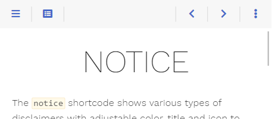
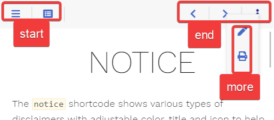

+++
title = "Topbar Modification"
weight = 27
+++

The theme comes with a reasonably configured topbar.



Nevertheless, your requirements may differ from this configuration. Luckily the theme got you covered as the themebar, its buttons and the functionality behind these buttons is fully configurable by you.

{}
All mentioned file names below can be clicked and show you the implementation for a better understanding.
{}

## Areas

The default configuration comes with three predefined areas that may contain an arbitrary set of buttons.



- [**start**](https://github.com/McShelby/hugo-theme-relearn/blob/main/layouts/partials/topbar/area/start.html): shown between menu and breadcrumb
- [**end**](https://github.com/McShelby/hugo-theme-relearn/blob/main/layouts/partials/topbar/area/end.html): shown on the opposite breadcrumb side in comparison to the _start_ area
- [**more**](https://github.com/McShelby/hugo-theme-relearn/blob/main/layouts/partials/topbar/area/more.html): shown when pressing the {}{} _more_ button in the topbar

While you can not add additional areas in the topbar, you are free to configure addtional buttons that behave like the _more_ button, providing further user defined areas.

## Buttons

The theme ships with the following predefined buttons (from left to right in the screenshot)

- {}{} [**sidebar**](https://github.com/McShelby/hugo-theme-relearn/blob/main/layouts/partials/topbar/button/sidebar.html): opens the sidebar flyout if in mobile layout
- {}{} [**toc**](https://github.com/McShelby/hugo-theme-relearn/blob/main/layouts/partials/topbar/button/toc.html): opens the table of contents in an overlay
- {}{} [**edit**](https://github.com/McShelby/hugo-theme-relearn/blob/main/layouts/partials/topbar/button/edit.html): browses to the editable page if the `editURL` [parameter is set](basics/configuration)
- {}{} [**print**](https://github.com/McShelby/hugo-theme-relearn/blob/main/layouts/partials/topbar/button/print.html): browses to the chapters printable page if [print support](basics/customization#activate-print-support) was activated
- {}{} [**prev**](https://github.com/McShelby/hugo-theme-relearn/blob/main/layouts/partials/topbar/button/prev.html): browses to the previous page if there is one
- {}{} [**next**](https://github.com/McShelby/hugo-theme-relearn/blob/main/layouts/partials/topbar/button/next.html): browses to the next page if there is one
- {}{} [**more**](https://github.com/McShelby/hugo-theme-relearn/blob/main/layouts/partials/topbar/button/more.html): opens the overlay for the _more_ area

Not all buttons are displayed at every given time. This is configurable (see below if interested).

## Redefining Areas

Each predefined area and button comes in their own file. By that it is easy for you to overwrite an area file in your installation reusing only the buttons you like.

Eg. you can redefine the predefined _end_ area by adding the file [`layouts/partials/topbar/area/end.html`](https://github.com/McShelby/hugo-theme-relearn/blob/main/layouts/partials/topbar/area/end.html) in your installation (not in the theme itself) to remove all but the _more_ button.

The below example sets an explicit value for the `onempty` parameter, overriding the specific default value for this button (these defaults vary depending on the button). The parameter causes the _more_ button to always be displayed instead of hiding once its content is empty.

````go
{{ partial "topbar/button/more.html" (dict
  "page" .
  "onempty" "disable"
)}}
````

## Defining own Buttons

### Button Types

The theme distingushies between two types of buttons:

- [**button**](#button): a clickable button that either browses to another site, triggers a user defined script or opens an overlay containing user defined content
- [**area-button**](#area-button): the template for the {}{} _more_ button, to define your own area overlay buttons

### Button Parameter

#### Screen Widths and Actions

Depending on the screen width you can configure how the button should behave. Screen width is divided into three classes:

- **s**: (controlled by the `onwidths` parameter) mobile layout where the menu sidebar is hidden
- **m**: (controlled by the `onwidthm` parameter) desktop layout with visible sidebar while the content area width still resizes
- **l**: (controlled by the `onwidthl` parameter) desktop layout with visible sidebar once the content area reached its maximum width

For each width class, you can configure one of the following actions:

- `show`: the button is displayed in its given area
- `hide`: the button is removed
- `area-XXX`: the button is moved from its given area into the area `XXX`; eg. this is used to move buttons to the _more_ area overlay in the mobile layout

#### Hiding and Disabling Stuff

While hiding a button dependend on the screen size can be configured with the above described _hide_ action, you may want to hide the button on certain other conditions aswell.

For example, the _print_ button in its default configuration should only be displayed if print support was configured. This is done in your button template by checking the conditions first before displaying the button (see [`layouts/partials/topbar/button/print.html`](https://github.com/McShelby/hugo-theme-relearn/blob/main/layouts/partials/topbar/button/print.html)).

Another prefered condition for hiding a button is, if the displayed overlay is empty. This is the case for the _toc_ (see [`layouts/partials/topbar/button/toc.html`](https://github.com/McShelby/hugo-theme-relearn/blob/main/layouts/partials/topbar/button/toc.html)) aswell as the _more_ button (see [`layouts/partials/topbar/button/more.html`](https://github.com/McShelby/hugo-theme-relearn/blob/main/layouts/partials/topbar/button/more.html)) and controlled by the parameter `onempty`.

This parameter can have one of the following values:

- `disable`: the button displayed in disabled state if the overlay is empty
- `hide`: the button is removed if the overlay is empty

If you want to disable a button containing _no overlay_, this can be achieved by an empty `href` parameter. An example can be seen in the _prev_ button (see `layouts/partials/topbar/button/prev.html`) where the URL for the previous site may be empty.

## Reference

### Button

Contains the basic button functionality and is used as a base implementation for all other buttons ([`layouts/partials/topbar/func/button.html`](https://github.com/McShelby/hugo-theme-relearn/blob/main/layouts/partials/topbar/func/button.html)).

Call this from your own button templates if you want to implement a button without an overlay like the _print_ button ([`layouts/partials/topbar/button/print.html`](https://github.com/McShelby/hugo-theme-relearn/blob/main/layouts/partials/topbar/button/print.html)) or with an overlay containing arbitrary content like the _toc_ button ([`layouts/partials/topbar/button/toc.html`](https://github.com/McShelby/hugo-theme-relearn/blob/main/layouts/partials/topbar/button/toc.html)).

For displaying an area in the button's overlay, see [Area-Button](#area-button).

#### Parameter

| Name                  | Default         | Notes       |
|-----------------------|-----------------|-------------|
| **page**              | _&lt;empty&gt;_ | Mandatory reference to the page. |
| **class**             | _&lt;empty&gt;_ | Mandatory unique class name for this button. Displaying two buttons with the same value for **class** is undefined. |
| **href**              | _&lt;empty&gt;_ | Either the destination URL for the button or JavaScript code to be executed on click.<br><br>- if starting with `javascript:` all following text will be executed in your browser<br>- every other string will be interpreted as URL<br>- if empty the button will be displayed in disabled state regardless of its **content** |
| **icon**              | _&lt;empty&gt;_ | [Font Awesome icon name](shortcodes/icon#finding-an-icon). |
| **onempty**           | `disable`       | Defines what to do with the button if the content parameter was set but ends up empty:<br><br>- `disable`: The button is displayed in disabled state.<br>- `hide`: The button is removed. |
| **onwidths**          | `show`          | The action, that should be executed if the site is displayed in the given width:<br><br>- `show`: The button is displayed in its given area<br>- `hide`: The button is removed.<br>- `area-XXX`: The button is moved from its given area into the area `XXX`. |
| **onwidthm**          | `show`          | See above. |
| **onwidthl**          | `show`          | See above. |
| **hint**              | _&lt;empty&gt;_ | Arbitrary text displayed in the tooltip. |
| **title**             | _&lt;empty&gt;_ | Arbitrary text for the button. |
| **content**           | _&lt;empty&gt;_ | Arbitrary HTML to put into the content overlay. This parameter may be empty. In this case no overlay will be generated. |

### Area-Button

Contains the basic functionality to display area overlay buttons ([`layouts/partials/topbar/func/area-button.html`](https://github.com/McShelby/hugo-theme-relearn/blob/main/layouts/partials/topbar/func/area-button.html)).

Call this from your own button templates if you want to implement a button with an area overlay like the _more_ button ([`layouts/partials/topbar/button/more.html`](https://github.com/McShelby/hugo-theme-relearn/blob/main/layouts/partials/topbar/button/more.html)).

#### Parameter

| Name                  | Default         | Notes       |
|-----------------------|-----------------|-------------|
| **page**              | _&lt;empty&gt;_ | Mandatory reference to the page. |
| **area**              | _&lt;empty&gt;_ | Mandatory unique area name for this area. Displaying two areas with the same value for **area** is undefined. |
| **icon**              | _&lt;empty&gt;_ | [Font Awesome icon name](shortcodes/icon#finding-an-icon). |
| **onempty**           | `disable`       | Defines what to do with the button if the content overlay is empty:<br><br>- `disable`: The button is displayed in disabled state.<br>- `hide`: The button is removed. |
| **onwidths**          | `show`          | The action, that should be executed if the site is displayed in the given width:<br><br>- `show`: The button is displayed in its given area<br>- `hide`: The button is removed.<br>- `area-XXX`: The button is moved from its given area into the area `XXX`. |
| **onwidthm**          | `show`          | See above. |
| **onwidthl**          | `show`          | See above. |
| **hint**              | _&lt;empty&gt;_ | Arbitrary text displayed in the tooltip. |
| **title**             | _&lt;empty&gt;_ | Arbitrary text for the button. |

### Predefined Buttons

The predefined buttons by the theme (all other buttons besides the _more_ and _toc_ button in [`layouts/partials/topbar/button`](https://github.com/McShelby/hugo-theme-relearn/blob/main/layouts/partials/topbar/button)).

Call these from your own redefined area templates if you want to use default button behavior.

The `<varying>` parameter values are different for each button and configured for standard behavior as seen on this page.

#### Parameter

| Name                  | Default           | Notes       |
|-----------------------|-------------------|-------------|
| **page**              | _&lt;empty&gt;_   | Mandatory reference to the page. |
| **onwidths**          | _&lt;varying&gt;_ | The action, that should be executed if the site is displayed in the given width:<br><br>- `show`: The button is displayed in its given area<br>- `hide`: The button is removed.<br>- `area-XXX`: The button is moved from its given area into the area `XXX`. |
| **onwidthm**          | _&lt;varying&gt;_ | See above. |
| **onwidthl**          | _&lt;varying&gt;_ | See above. |

### Predefined Overlay-Buttons

The predefined buttons by the theme that open an overlay (the _more_ and _toc_ button in [`layouts/partials/topbar/button`](https://github.com/McShelby/hugo-theme-relearn/blob/main/layouts/partials/topbar/button)).

Call these from your own redefined area templates if you want to use default button behavior utilizing overlay functionality.

The `<varying>` parameter values are different for each button and configured for standard behavior as seen on this page.


#### Parameter

| Name                  | Default           | Notes       |
|-----------------------|-------------------|-------------|
| **page**              | _&lt;empty&gt;_   | Mandatory reference to the page. |
| **onempty**           | `disable`       | Defines what to do with the button if the content overlay is empty:<br><br>- `disable`: The button is displayed in disabled state.<br>- `hide`: The button is removed. |
| **onwidths**          | _&lt;varying&gt;_ | The action, that should be executed if the site is displayed in the given width:<br><br>- `show`: The button is displayed in its given area<br>- `hide`: The button is removed.<br>- `area-XXX`: The button is moved from its given area into the area `XXX`. |
| **onwidthm**          | _&lt;varying&gt;_ | See above. |
| **onwidthl**          | _&lt;varying&gt;_ | See above. |
